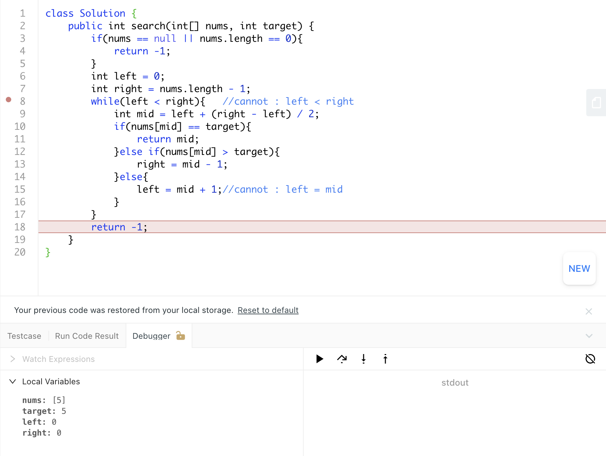

## 704. Classical Binary Search

- [704. Classical Binary Search](https://novemberfall.github.io/LeetCode-NoteBook/#/Array/classicalBinarySearch)
---
### template.2

```java
class Solution {
    public int search(int[] nums, int target) {
        int left = 0, right = nums.length - 1;
        while (left < right) {
            int mid = left + ((right - left) >> 1);
            if (nums[mid] < target) {
                left = mid + 1;
            } else {
                right = mid;
            }
        }
        return nums[left] == target ? left : -1;
    }
}
```


---
### template.1


```java
public class classical {
    
    public static int binarySearch(int[] array, int target){
        if(array == null || array.length == 0){
            return -1;
        }
        int left = 0;
        int right = array.length - 1;
        while(left <= right){   //cannot : left < right
            int mid = left + (right - left) / 2;
            if(array[mid] == target){
                return mid;
            }else if(array[mid] > target){
                right = mid - 1;
            }else{
                left = mid + 1;//cannot : left = mid
            }
        }
        return -1;
    }
    public static void main(String[] args) {
        int[] a ={1, 2, 4, 5, 7, 8, 9};
        int targetIndex = binarySearch(a, 4);
        System.out.println(targetIndex);
    }
}
```

---

- 注意：如果 `while(left < right)` :



- let's look at this example, `left = 0`, `right = 0`, directly `return -1`

