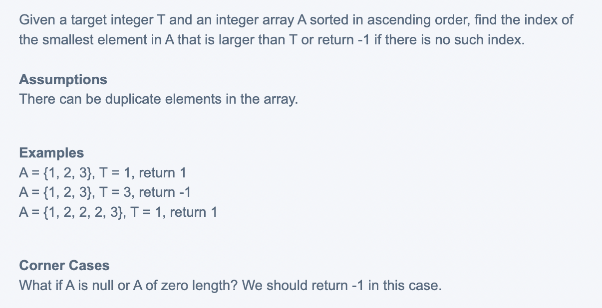

## Smallest Element Larger than Target




## Analysis:

- [具体分析这里不再解释，可以参考leetCode q.34](https://novemberfall.github.io/LeetCode-NoteBook/#/m3/FirstLastPositionOfSortedArr)

- 以及也对 `while(left < right - 1){//prevent infinite loop` 做了充分解释

```ruby
T = 1
0  1  2  3  4  
1  2  2  2  3  
l           r


0  1  2  3  4  
1  2  2  2  3  
l     r              m  =  2


0  1  2  3  4  
1  2  2  2  3  
l  r                 m  =  1


0  1  2  3  4  
1  2  2  2  3  
l  r                 m  =  0


## that's why we need to set :
##    while (left < right - 1),    otherwise infinite loop


### another example:

T = 2
  0  1  2  3  4
  1, 2, 2, 2, 3
  l           r


  1, 2, 2, 2, 3
        l     r        mid = 2


  1, 2, 2, 2, 3
           l  r        mid = 3

```


```java
public class Solution {
  public int smallestElementLargerThanTarget(int[] array, int target) {
    if(array == null || array.length == 0){
      return -1;
    }
    int left = 0;
    int right = array.length - 1;
    while(left < right - 1){//prevent infinite loop
      int mid = left + (right - left) / 2;
      if(array[mid] == target){
        left = mid; // case1
      } else if (array[mid] < target) {
        left = mid; // case2 (can merge with case 1)
      } else {
        right = mid; // case3
      }
    }

    // Post processing
    if(array[left] > target){ // check a[left] against target first
      return left;
    }
    if(array[right] > target){ // then check a[right] against target 
      return right;
    }
    return -1;
  }
}
```