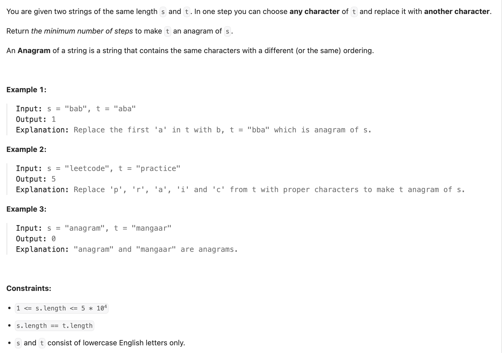

## 1347. Minimum Number of Steps to Make Two Strings Anagram

---

```py
class Solution:
    def minSteps(self, s: str, t: str) -> int:
        sfreq = [0] * 26
        tfreq = [0] * 26
        for c in s:
            sfreq[ord(c) - ord('a')] += 1
        for c in t:
            tfreq[ord(c) - ord('a')] += 1
        
        cnt = 0
        for i in range(26):
            if sfreq[i] == tfreq[i]:
                continue
            while sfreq[i] != tfreq[i]:
                if sfreq[i] > tfreq[i]:
                    tfreq[i] += 1
                    cnt += 1
                if sfreq[i] < tfreq[i]:
                    tfreq[i] -= 1
                    cnt += 1
        return cnt // 2
```