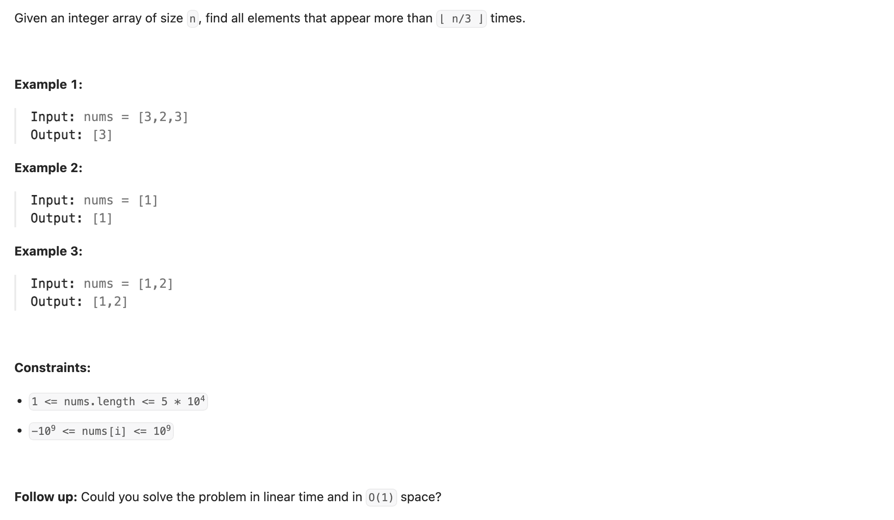

## 229. Majority Element II



```py
class Solution:
    def majorityElement(self, nums: List[int]) -> List[int]:
        freq = dict()
        res = []
        for num in nums:
            freq[num] = freq.get(num, 0) + 1

        for num, count in freq.items():
            if count > (len(nums) // 3):
                res.append(num)
        return res
```