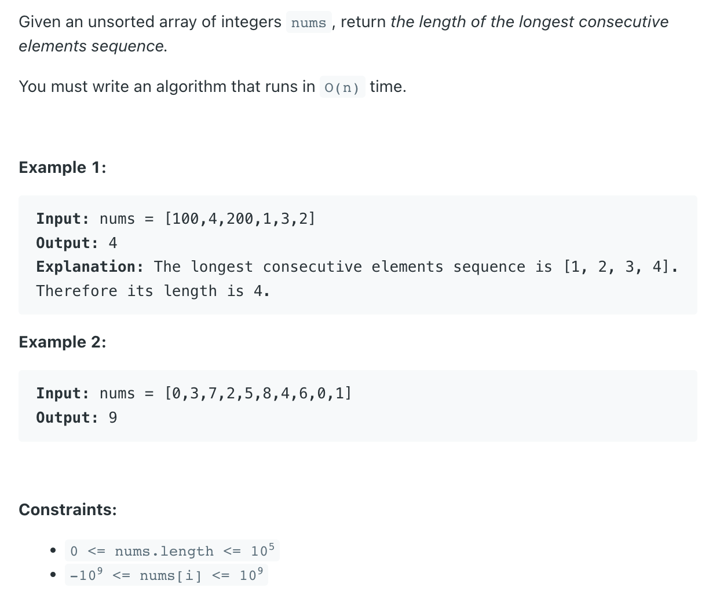
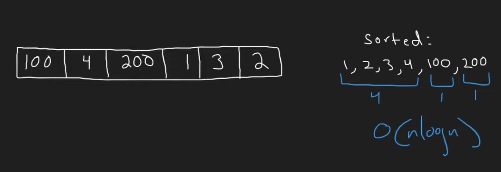
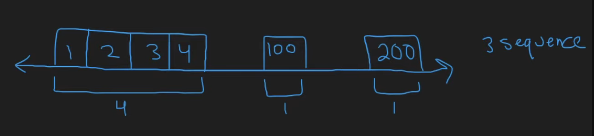
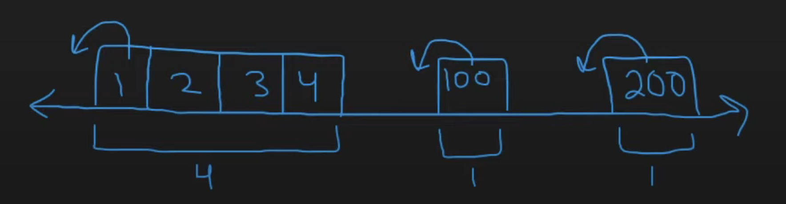
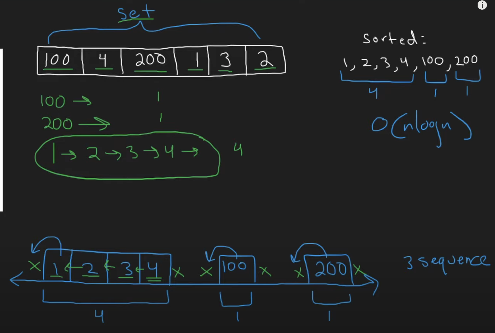

## 128. Longest Consecutive Sequence

---
- [youTuBe Video](https://www.youtube.com/watch?v=P6RZZMu_maU)



- Can we do better? Yes




- for `first sequence` has no left neighbour, for `second sequence` has no left neighbour
  for `third sequence` has no left neighbour


---

- 这个做法 TLE

```java
class _128_LongestConsecutiveSequence {
    public int longestConsecutive(int[] nums) {
        Set<Integer> set = new HashSet<>();
        for (int n : nums) {
            set.add(n);
        }
        int longest = 0;
        for (int num : nums) {
            if (!set.contains(num - 1)) {
                int curNum = num;
                int len = 1;
                while (set.contains(curNum + 1)) {
                    curNum += 1;
                    len += 1;
                }
                longest = Math.max(longest, len);
            }

        }
        return longest;
    }
}
```
---

### Union By Size | disjoint

- [Disjoint 更详细的中文解释以及案例](https://leetcode.cn/problems/longest-consecutive-sequence/solutions/1453487/by-lfool-jdy4/)


---

### Method 2

```ruby
l = 2, r = 4
        [0      0       2       3       4       5       100]
                        l               r


l = 1, r = 4
        [0      0       2       3       4       5       100]
                    l                   r


l = 1, r = 5
        [0      0       2       3       4       5       100]
                    l                           r


l = 1, r = 6
        [0      0       2       3       4       5       100]
                    l                               r

   length = 6 - 1 - 1 = 4
```


```java
class LongestConsecutiveSequence_v2 {
    public int longestConsecutive(int[] nums) {
        Set<Integer> set = new HashSet<>();
        int longest = 0;
        for (int num : nums) {
            set.add(num);
        }

        for (int num : nums) {
            int left = num - 1;
            int right = num + 1;
            while (set.remove(left)) {
                left--;
            }
            while (set.remove(right)) {
                right++;
            }
            longest = Math.max(longest, right - left - 1);
            if (set.isEmpty()) {
                return longest;
            }
        }
        return longest;
    }
}
```