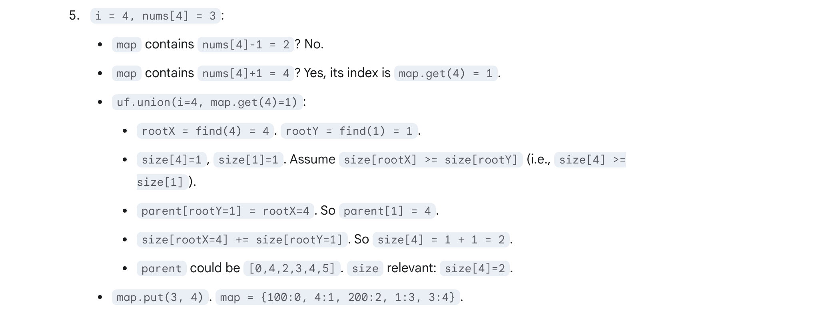

## 128. Longest Consecutive Sequence

---
- [youTuBe Video](https://www.youtube.com/watch?v=P6RZZMu_maU)


- Can we do better? Yes


- for `first sequence` has no left neighbour, for `second sequence` has no left neighbour
  for `third sequence` has no left neighbour


---

- 这个做法 TLE

```java
class _128_LongestConsecutiveSequence {
    public int longestConsecutive(int[] nums) {
        Set<Integer> set = new HashSet<>();
        for (int n : nums) {
            set.add(n);
        }
        int longest = 0;
        for (int num : nums) {
            if (!set.contains(num - 1)) {
                int curNum = num;
                int len = 1;
                while (set.contains(curNum + 1)) {
                    curNum += 1;
                    len += 1;
                }
                longest = Math.max(longest, len);
            }

        }
        return longest;
    }
}
```
---

### Union By Size | disjoint

- [Disjoint 更详细的中文解释以及案例](https://leetcode.cn/problems/longest-consecutive-sequence/solutions/1453487/by-lfool-jdy4/)


```java
    public int getMaxComponentSize() { 
        int maxSize = 0; 

        //  parent.length is 'n', the number of elements UnionFind was initialized with.
        for (int i = 0; i < parent.length; i++) {

            //    Check if the current element 'i' is a root of its component (subset).
            //    A node is a root if its parent is itself.
            if (i == parent[i]) {
                //    If 'i' is a root, then size[i] holds the total number of elements
                //    in the component (subset) that 'i' represents.
                //    Update maxSize if the size of this component is larger than any found previously.
                maxSize = Math.max(maxSize, size[i]);
            }
        }
        return maxSize;
    }
```





---

```java
class union_find {
    public int longestConsecutive(int[] nums) {
        UnionFind unionFind = new UnionFind(nums.length);
        Map<Integer, Integer> map = new HashMap<>();
        UnionFind uf = new UnionFind(nums.length);
        for (int i = 0; i < nums.length; i++) {
            if (map.containsKey(nums[i])) {
                continue;
            }
            if (map.containsKey(nums[i] - 1)) {
                uf.union(i, map.get(nums[i] - 1));
            }
            if (map.containsKey(nums[i] + 1)) {
                uf.union(i, map.get(nums[i] + 1));
            }
            map.put(nums[i], i);
        }
        return uf.getMaxComponentSize();
    }

    class UnionFind {
        private int[] parent;
        private int[] size;

        public UnionFind(int n) {
            parent = new int[n];
            size = new int[n];
            for (int i = 0; i < n; i++) {
                parent[i] = i;
                size[i] = 1;
            }
        }

        public int find(int x) {
            if (x == parent[x]) {
                return x;
            }
            return parent[x] = find(parent[x]);
        }

        public void union(int x, int y) {
            int rootX = find(x);
            int rootY = find(y);
            if (rootX == rootY) {
                return;
            }
            if (size[rootX] >= size[rootY]) {
                parent[rootY] = rootX;
                size[rootX] += size[rootY];
            } else {
                parent[rootX] = rootY;
                size[rootY] += size[rootX];
            }
        }

        public int getMaxComponentSize() {
            int maxSize = 0;
            for (int i = 0; i < parent.length; i++) {
                if (i == parent[i]) {
                    maxSize = Math.max(maxSize, size[i]);
                }
            }
            return maxSize;
        }
    }
}
```


---

### Method 2

```ruby
l = 2, r = 4
        [0      0       2       3       4       5       100]
                        l               r


l = 1, r = 4
        [0      0       2       3       4       5       100]
                    l                   r


l = 1, r = 5
        [0      0       2       3       4       5       100]
                    l                           r


l = 1, r = 6
        [0      0       2       3       4       5       100]
                    l                               r

   length = 6 - 1 - 1 = 4
```


```java
class LongestConsecutiveSequence_v2 {
    public int longestConsecutive(int[] nums) {
        Set<Integer> set = new HashSet<>();
        int longest = 0;
        for (int num : nums) {
            set.add(num);
        }

        for (int num : nums) {
            int left = num - 1;
            int right = num + 1;
            while (set.remove(left)) {
                left--;
            }
            while (set.remove(right)) {
                right++;
            }
            longest = Math.max(longest, right - left - 1);
            if (set.isEmpty()) {
                return longest;
            }
        }
        return longest;
    }
}
```