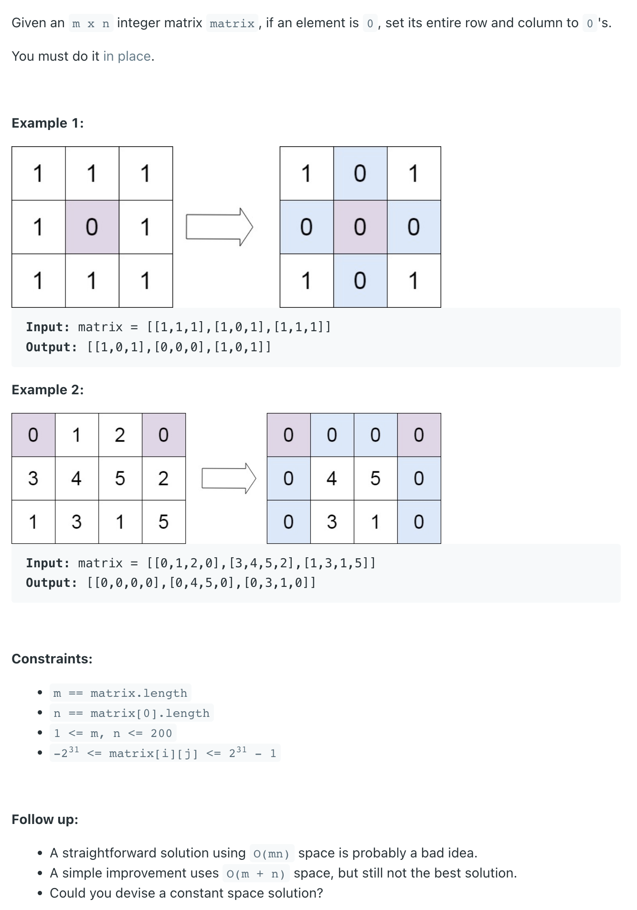

## 73. Set Matrix Zeroes

---

### Using HashSet

```java
class setMatrixZeroes_bruteForce {
    public void setZeroes(int[][] matrix) {
        Set<Integer> rows = new HashSet<>();
        Set<Integer> cols = new HashSet<>();

        for (int r = 0; r < matrix.length; r++) {
            for (int c = 0; c < matrix[0].length; c++) {
                if (matrix[r][c] == 0) {
                    rows.add(r);
                    cols.add(c);
                }
            }
        }

        for (int r : rows) {
            for (int c = 0; c < matrix[r].length; c++) {
                matrix[r][c] = 0;
            }
        }

        for (int c : cols) {
            for (int r = 0; r < matrix.length; r++) {
                matrix[r][c] = 0;
            }
        }
    }

    public static void main(String[] args) {
        setMatrixZeroes_bruteForce smz = new setMatrixZeroes_bruteForce();
        int[][] matrix = new int[][]{
                {0, 1, 2, 0}, {3, 4, 5, 2}, {1, 3, 1, 5}
        };
        smz.setZeroes(matrix);
        System.out.println(Arrays.deepToString(matrix));
        // [[0, 0, 0, 0], [0, 4, 5, 0], [0, 3, 1, 0]]
    }
}
```
---

### Space: O(1) 

```ruby
    [0, 1, 2, 0]
    [3, 4, 5, 2]
    [1, 3, 1, 5]
```

```java
class setMatrixZeroes {
    public void setZeroes(int[][] matrix) {
        boolean firstRow = false, firstColumn = false;
        for (int i = 0; i < matrix.length; i++) {
            for (int j = 0; j < matrix[0].length; j++) {
                if (matrix[i][j] == 0) {
                    if (i == 0) {
                        firstRow = true;
                    }
                    if (j == 0) {
                        firstColumn = true;
                    }
                    matrix[0][j] = 0;
                    matrix[i][0] = 0;
                }
            }
        }

        for (int i = 1; i < matrix.length; i++) {
            for (int j = 1; j < matrix[0].length; j++) {
                if (matrix[i][0] == 0 || matrix[0][j] == 0) {
                    matrix[i][j] = 0;
                }
            }
        }
        if (firstRow) {
            for (int j = 0; j < matrix[0].length; j++) {
                matrix[0][j]  = 0;
            }
        }
        if (firstColumn) {
            for (int i = 0; i < matrix.length; i++) {
                matrix[i][0]  = 0;
            }
        }
    }
}
```