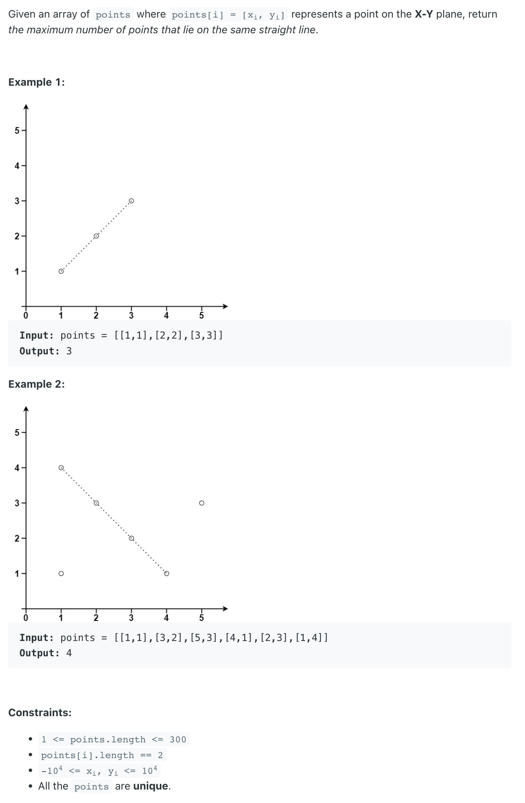
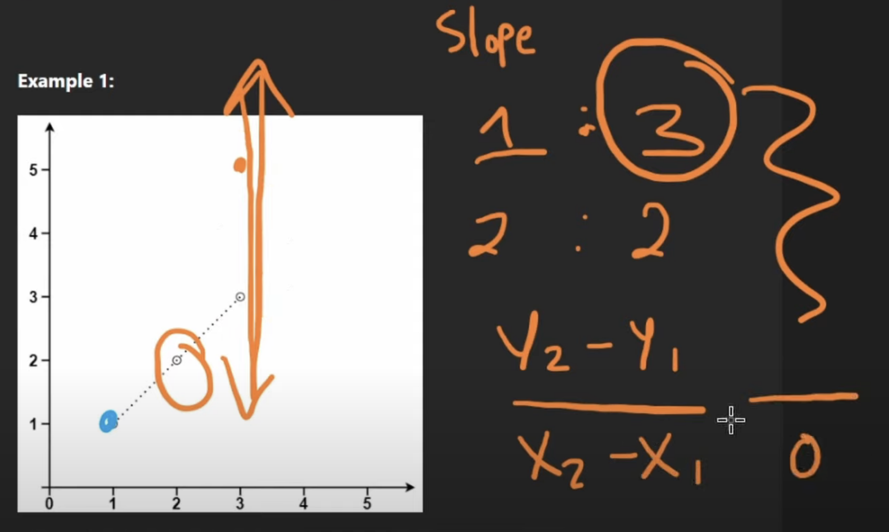

## 149. Max Points on a Line


- [youtube video](https://www.youtube.com/watch?v=Bb9lOXUOnFw)
---

- A line is determined by two factors, say `y = ax + b`
- We have `(y2 - y1) = a(x2 - x1)` , `a = (y2-y1) / (x2-x1)`, **a** is a **slope**(rational), 
  `b` is canceled since `b` is a constant


- 假如一种情况： 两个点的 `x1`, `x2` 都是 `0`, 那么 `y1`, `y2` 都在垂直线上，则 slope 无穷大！

---

```java
class _149_MaxPointsOnALine {
    public int maxPoints(int[][] points) {
        int n = points.length;
        if (n <= 2) {// 2 or less points can claways from a line
            return n;
        }
        int res = 2;
        for (int i = 0; i < n; i++) {
            int[] a = points[i];
            Map<Double, Integer> map = new HashMap<>();
            for (int j = 0; j < n; j++) {
                int[] b = points[j];
                if (a[0] == b[0] && a[1] == b[1]) {
                    continue;
                }
                double slope = 0;
                if (b[0] - a[0] == 0) {
                    slope = Double.MAX_VALUE;
                } else {
                    slope = (b[1] - a[1]) / (double) (b[0] - a[0]);
                }
                // `map.getOrDefault(slope, 0)+1` is adding 1 more point count for
                // that slope if we already had that slope.
                map.put(slope, map.getOrDefault(slope, 1) + 1);
                res = Math.max(res, map.get(slope));
            }
        }
        return res;
    }
}
```