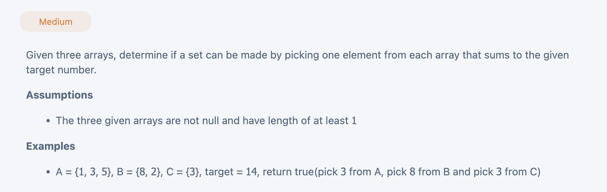

## 3 Sum 3 Arrays

---

### Brute Force

```py
class Solution(object):
    def exist(self, a, b, c, target):
        """
        input: int[] a, int[] b, int[] c, int target
        return: boolean
        """
        # write your solution here
        m, n, o = len(a), len(b), len(c)
        for i in range(m):
            num_a = a[i]
            for j in range(n):
                num_b = b[j]
                for k in range(o):
                    num_c = c[k]
                    if num_a + num_b + num_c == target:
                        return True
        return False
```
---

### Set

```py
class Solution(object):
    def exist(self, a, b, c, target):
        """
        input: int[] a, int[] b, int[] c, int target
        return: boolean
        """
        # write your solution here
        s = set(a)
        for num_b in b:
            for num_c in c:
                if target - num_b - num_c in s:
                    return True
        return False

```