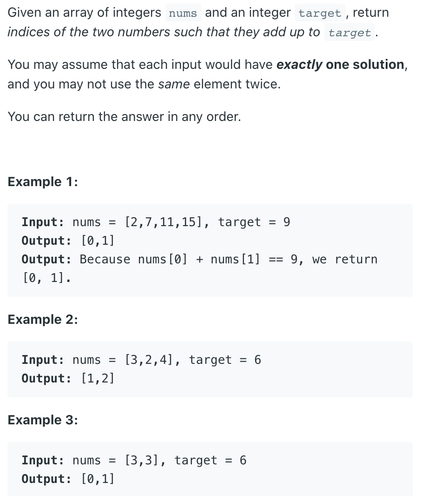
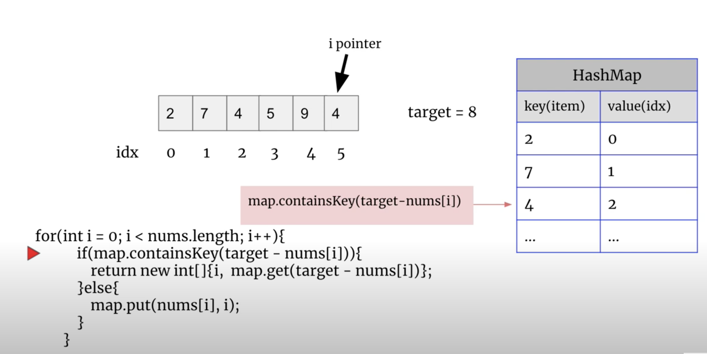

## 1. Two Sum

---




```java
public int[] towSum(int[] nums, int target){
    Map<Integer, Integer> map = new HashMap<>();
    for(int i=0; i<nums.length; i++){
        int complement = target - nums[i];
        if(map.cotainsKey(complement)){
            return new int[]{ map.get(complement),i}
        }
        map.put(nums[i], i);
    }
    throw new IllegalArgumentException("No two sum solution");
}
```
---
### Brute Force

```java
public class bruteForce {
    public int[] twoSum(int[] nums, int target) {
        for (int i = 0; i < nums.length; i++) {
            for (int j = i + 1; j < nums.length; j++) {
                if (nums[i] + nums[j] == target) {
                    return new int[]{i, j};
                }
            }
        }
        return new int[]{-1, -1};
    }
}
```

---

## Two Pointers

```java
class twoSum {
    public static int[] twoSum(int[] nums, int target) {
        int n = nums.length;
        Integer[] original = new Integer[n];
        for (int i = 0; i < n; i++) {
            original[i] = i;
        }
        Arrays.sort(original, (index_a, index_b) -> (nums[index_a] - nums[index_b]));
        int left = 0, right = n - 1;
        while (left < right) {
            int curSum = nums[original[left]] + nums[original[right]];
            if (curSum == target) {
                return new int[]{original[left], original[right]};
            } else if (curSum < target) {
                left++;
            } else {
                right--;
            }
        }
        return new int[]{-1, -1};
    }
}
```
---

### Python

```py
class Solution:
    def twoSum(self, nums: List[int], target: int) -> List[int]:
        prevMap = {} # val : index
        
        for i, num in enumerate(nums):
            diff = target - num
            if diff in prevMap:
                return [prevMap[diff], i]
            prevMap[num] = i
        return 
```


