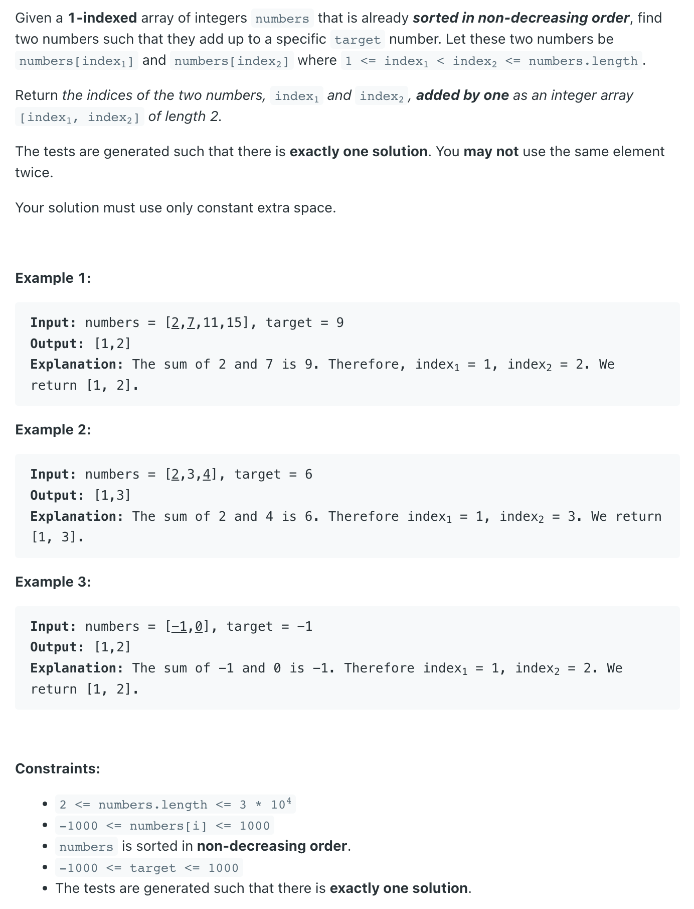

## 167. Two Sum II - Input Array Is Sorted

---
## Brute Force

```java
class bruteForce {
    // O(N^2)
    public int[] twoSum(int[] numbers, int target) {
        int n = numbers.length;
        for (int i = 0; i < n; i++) {
            for (int j = i + 1; j < n; j++) {
                if (numbers[i] + numbers[j] == target) {
                    return new int[]{i + 1, j + 1};
                }
            }
        }
        return new int[]{-1, -1};
    }
}
```
---

### HashMap

```java
class hashMap {
    public int[] twoSum(int[] numbers, int target) {
        Map<Integer, Integer> map = new HashMap<>();
        for (int i = 0; i < numbers.length; i++) {
            if (map.containsKey(target - numbers[i])) {
                return new int[]{map.get(target - numbers[i]), i + 1};
            }
            map.put(numbers[i], i + 1);
        }
        return new int[]{-1, -1};
    }
}
```
---

### Two Pointers

```java
class twoPointers {
    public int[] twoSum(int[] numbers, int target) {
        int left = 0, right = numbers.length - 1;
        while (left < right) {
            if (numbers[left] + numbers[right] > target) {
                right--;
            } else if (numbers[left] + numbers[right] < target) {
                left++;
            } else {
                return new int[]{left + 1, right + 1};
            }
        }
        return new int[]{-1, -1};
    }
}
```