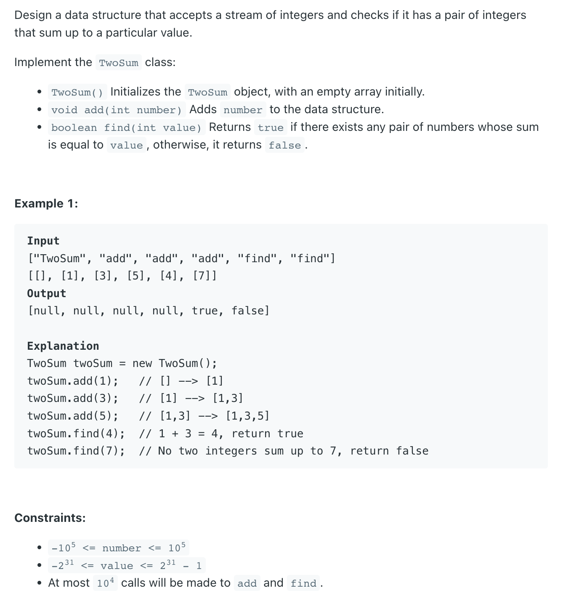

## 170. Two Sum III - Data structure design


```java
public class _170_TwoSum_III {
    Map<Integer, Integer> map;

    public _170_TwoSum_III() {
        map = new HashMap<>();
    }

    public void add(int number) {
        map.put(number, map.getOrDefault(number, 0) + 1);
    }

    public boolean find(int value) {
        for (int key : map.keySet()) {
            int num1 = key, num2 = value - num1;
            // num1 == num2 OR num1 != num2,  这里也可能配对的两个数字是相等的， 也可能不相等

            // case 1: 这里需要保证， map put() 操作两次对于相同的num
            //    i.e  map.put(4, ), mp.put(4, ),  target = 8
            //
            // case 2: 如果两个数字不相同， map.put(num1, ), map.put(num2, )
            if ((num1 == num2 && map.get(num1) > 1) ||(num1 != num2 && map.containsKey(num2))) {
                return true;
            }
        }
        return false;
    }

    public static void main(String[] args) {
        _170_TwoSum_III twoSum_iii = new _170_TwoSum_III();
        twoSum_iii.add(1);
        twoSum_iii.add(3);
        twoSum_iii.add(5);
        twoSum_iii.add(7);
        boolean res = twoSum_iii.find(8);
        System.out.println(res); // true
    }
}
```