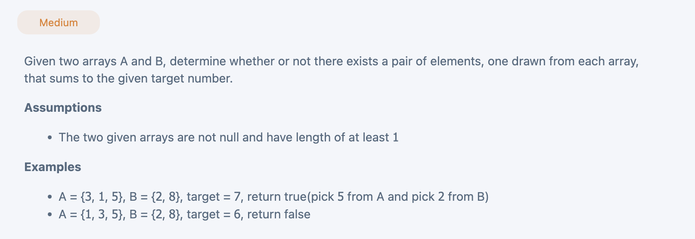

## 2 Sum 2 Arrays

---

### Brute Force

```py
class Solution(object):
  def existSum(self, a, b, target):
    """
    input: int[] a, int[] b, int target
    return: boolean
    """
    # write your solution here
    m = len(a)
    n = len(b)
    for i in range(m):
        num_a = a[i]
        for j in range(n):
            num_b = b[j]
            if num_a + num_b == target:
                return True
    return False
```
---

### set

```py
class Solution(object):
  def existSum(self, a, b, target):
    """
    input: int[] a, int[] b, int target
    return: boolean
    """
    # write your solution here
    s = set(a)
    for num in b:
      if (target - num) in s:
        return True
    return False
```