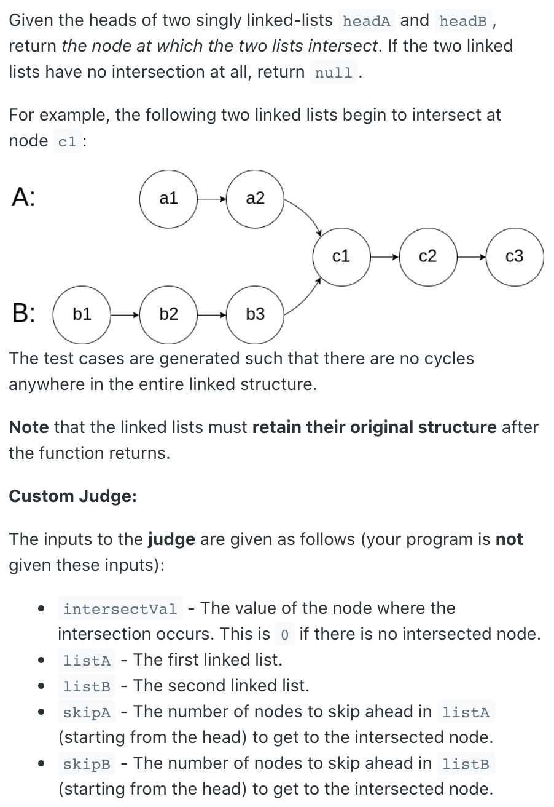
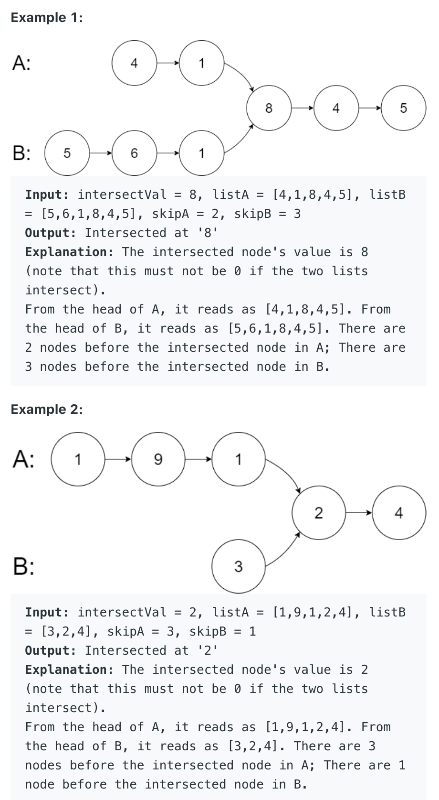
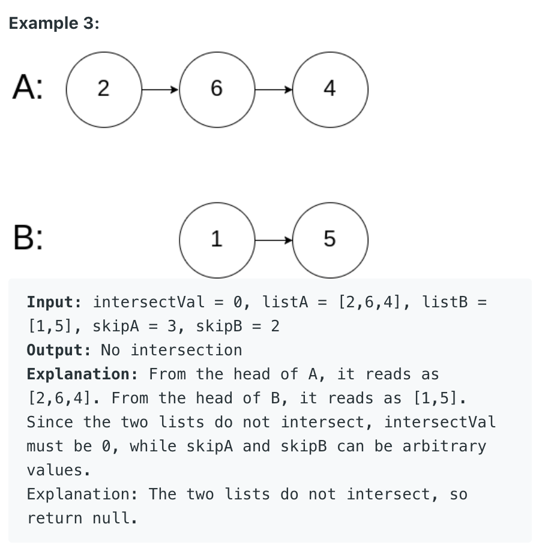

## 160. Intersection of Two Linked Lists




---

- Visualization of this solution:
  - Case 1 (Have Intersection & Same Len):

```ruby
       a
A:     a1 → a2 → a3
                   ↘
                     c1 → c2 → c3 → null
                   ↗            
B:     b1 → b2 → b3
       b

            a
A:     a1 → a2 → a3
                   ↘
                     c1 → c2 → c3 → null
                   ↗            
B:     b1 → b2 → b3
            b

                 a
A:     a1 → a2 → a3
                   ↘
                     c1 → c2 → c3 → null
                   ↗            
B:     b1 → b2 → b3
                 b

A:     a1 → a2 → a3
                   ↘ a
                     c1 → c2 → c3 → null
                   ↗ b            
B:     b1 → b2 → b3
```

- Since a == b is true, end loop while(a != b), return the intersection node a = c1.

### Case 2 (Have Intersection & Different Len):

```ruby
            a
A:          a1 → a2
                   ↘
                     c1 → c2 → c3 → null
                   ↗            
B:     b1 → b2 → b3
       b

                 a
A:          a1 → a2
                   ↘
                     c1 → c2 → c3 → null
                   ↗            
B:     b1 → b2 → b3
            b

A:          a1 → a2
                   ↘ a
                     c1 → c2 → c3 → null
                   ↗            
B:     b1 → b2 → b3
                 b

A:          a1 → a2
                   ↘      a
                     c1 → c2 → c3 → null
                   ↗ b           
B:     b1 → b2 → b3

A:          a1 → a2
                   ↘           a
                     c1 → c2 → c3 → null
                   ↗      b           
B:     b1 → b2 → b3

A:          a1 → a2
                   ↘                a = null, then a = b1
                     c1 → c2 → c3 → null
                   ↗           b           
B:     b1 → b2 → b3

A:          a1 → a2
                   ↘ 
                     c1 → c2 → c3 → null
                   ↗                b = null, then b = a1 
B:     b1 → b2 → b3
       a
       
            b         
A:          a1 → a2
                   ↘ 
                     c1 → c2 → c3 → null
                   ↗
B:     b1 → b2 → b3
            a

                 b         
A:          a1 → a2
                   ↘ 
                     c1 → c2 → c3 → null
                   ↗ 
B:     b1 → b2 → b3
                 a

A:          a1 → a2
                   ↘ b
                     c1 → c2 → c3 → null
                   ↗ a
B:     b1 → b2 → b3
```

- Since a == b is true, end loop while(a != b), return the intersection node a = c1.

### Case 3 (Have No Intersection & Same Len):

```ruby
       a
A:     a1 → a2 → a3 → null
B:     b1 → b2 → b3 → null
       b

                      a = null
A:     a1 → a2 → a3 → null
B:     b1 → b2 → b3 → null
                      b = null
```

- Since a == b is true (both refer to null), end loop while(a != b), return a = null.

### Case 4 (Have No Intersection & Different Len):

```ruby
       a
A:     a1 → a2 → a3 → a4 → null
B:     b1 → b2 → b3 → null
       b


                      a
A:     a1 → a2 → a3 → a4 → null
B:     b1 → b2 → b3 → null
                      b = null, then b = a1


       b                   a = null, then a = b1
A:     a1 → a2 → a3 → a4 → null
B:     b1 → b2 → b3 → null         


                           b = null
A:     a1 → a2 → a3 → a4 → null
B:     b1 → b2 → b3 → null
                      a = null
```

- Since a == b is true (both refer to null), end loop while(a != b), return a = null.

---

### 走到尽头见不到你，于是走过你来时的路，等到相遇时才发现，你也走过我来时的路。

```java
/**
 * Definition for singly-linked list.
 * public class ListNode {
 *     int val;
 *     ListNode next;
 *     ListNode(int x) {
 *         val = x;
 *         next = null;
 *     }
 * }
 */
public class Solution {
    public ListNode getIntersectionNode(ListNode headA, ListNode headB) {
        ListNode she = headA;
        ListNode he = headB;
        
        // 直到两人相遇
        while (she != he) {
            if (she != null) {
                // 如果她没走到尽头就一直走下去
                she = she.next;
            } else {
                // 直到尽头也没遇见他，所以她去往他走过的路
                she = headB;
            }
            
            if (he != null) {
                he = he.next;
            } else {
                he = headA;
            }
        }
        
        // 返回两人第一次相遇的地方
        return she;
    }
}
```