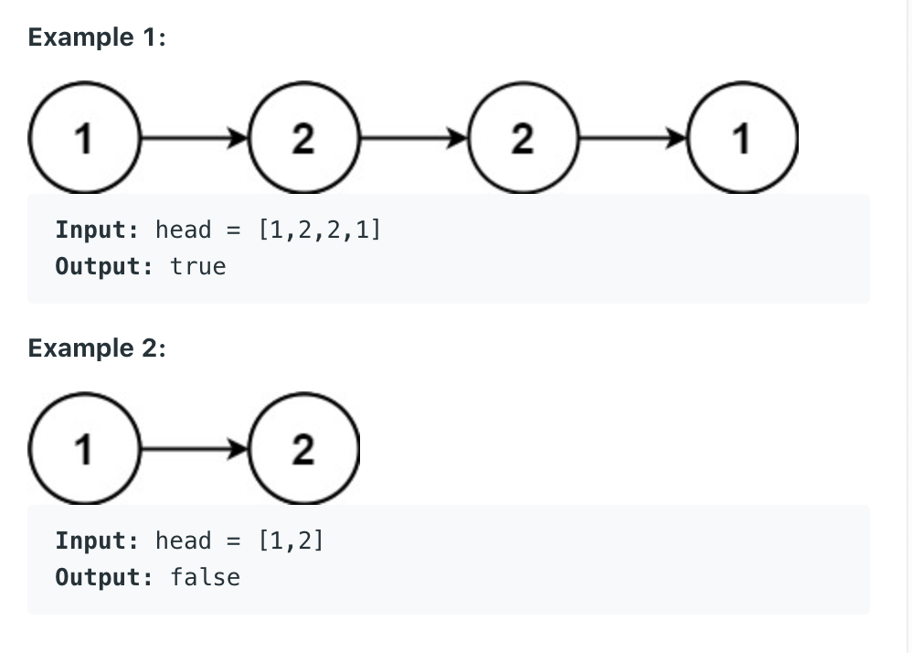

## 234. Palindrome Linked List

- Given the head of a singly linked list, return true if it is a palindrome.



---

### Brute Force

```java
/**
 * Definition for singly-linked list.
 * public class ListNode {
 *     int val;
 *     ListNode next;
 *     ListNode() {}
 *     ListNode(int val) { this.val = val; }
 *     ListNode(int val, ListNode next) { this.val = val; this.next = next; }
 * }
 */
class Solution {
    public boolean isPalindrome(ListNode head) {
        ListNode first = head;
        ListNode middle = findMiddle(head);
        ListNode second = reverse(middle.next);
        middle.next = null;
        while (second != null) {
            if (second.val != first.val) {
                return false;
            }
            second = second.next;
            first = first.next;
        }
        return true;
    }
    
    private ListNode findMiddle(ListNode head) {
        ListNode slow = head;
        ListNode fast = head;
        while (fast.next != null && fast.next.next != null) {
            slow = slow.next;
            fast = fast.next.next;
        }
        return slow;
    }
    
    private ListNode reverse(ListNode head) {
        ListNode prev = null;
        ListNode cur = head;
        ListNode next = null;
        while (cur != null) {
            next = cur.next;
            cur.next = prev;
            prev = cur;
            cur = next;
        }
        return prev;
    } 
}
```