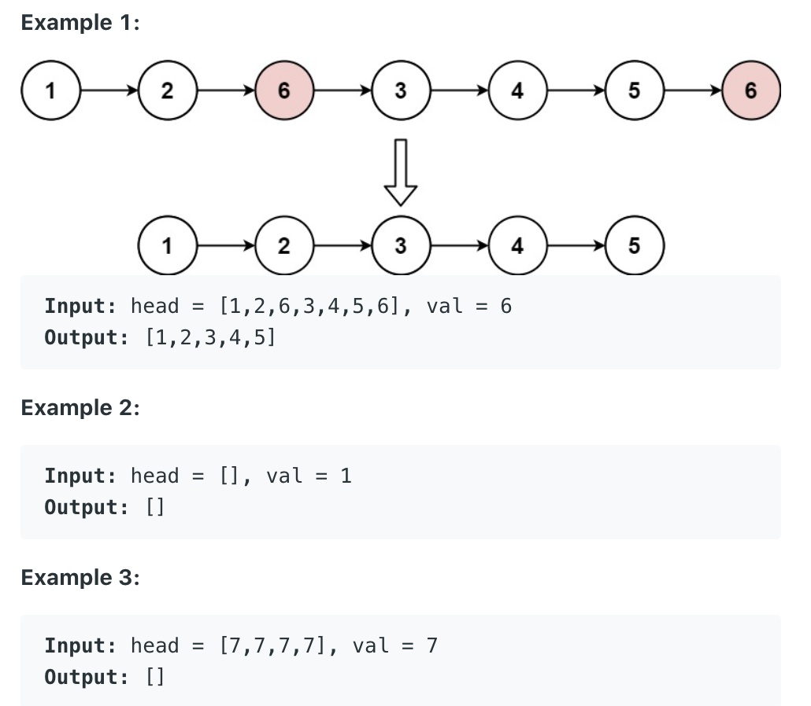
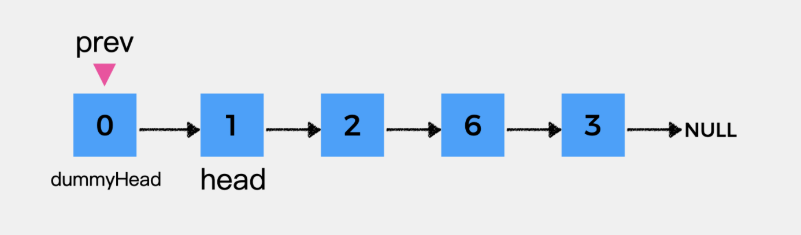
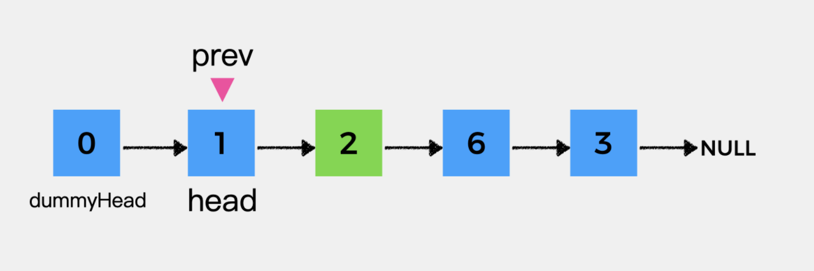
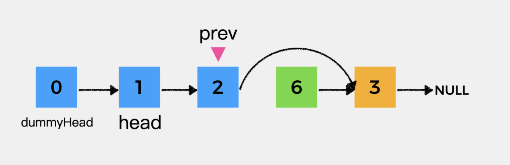

## 203. Remove Linked List Elements

- Given the head of a linked list and an integer `val`, remove all the nodes of the linked list 
  that has `Node.val == val`, and return the new head.



---

- Tmie = O(n)
- Space = O(1)

---







---

```java
/**
 * Definition for singly-linked list.
 * public class ListNode {
 *     int val;
 *     ListNode next;
 *     ListNode() {}
 *     ListNode(int val) { this.val = val; }
 *     ListNode(int val, ListNode next) { this.val = val; this.next = next; }
 * }
 */
class Solution {
    public ListNode removeElements(ListNode head, int val) {
        ListNode dummy = new ListNode(0);
        dummy.next = head;
        ListNode cur = dummy;
        while (cur.next != null) {
            if (cur.next.val == val) {
                cur.next = cur.next.next;
            } else {
                cur = cur.next;
            }                  
        }
        return dummy.next;
    }
}
```