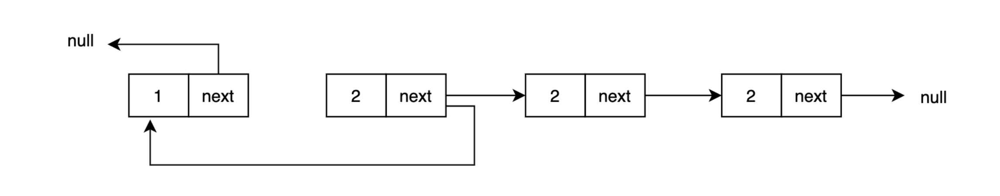
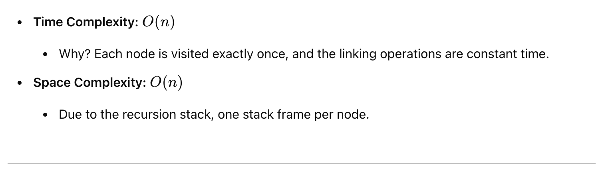
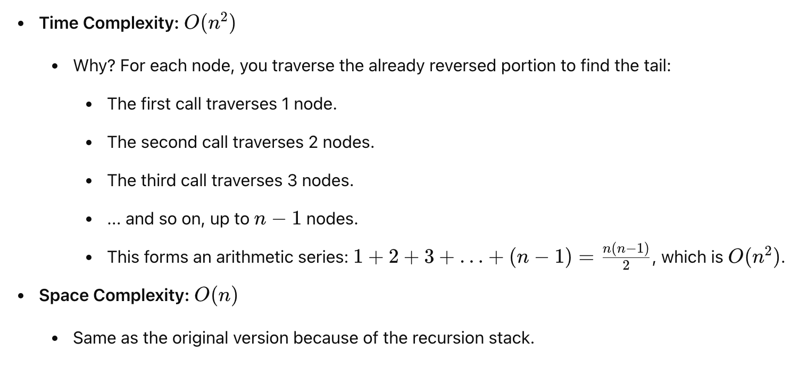
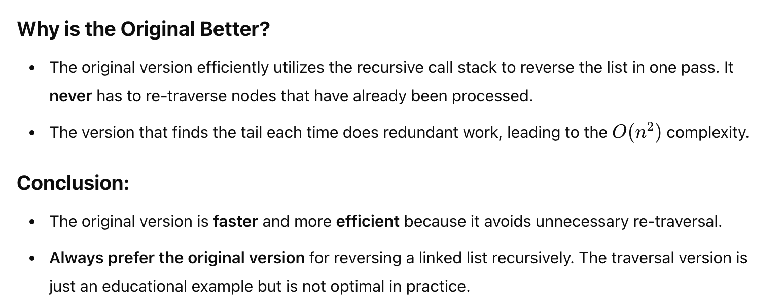

## 206. Reverse Linked List


---

### iteratively method:

```java
Reverse a singly-linked list iteratively.

Examples

L = null, return null
L = 1 -> null, return 1 -> null
L = 1 -> 2 -> 3 -> null, return 3 -> 2 -> 1 -> null
 
```

### my Analysis:

```java
ListNode prev, cur, next

start iteratively reverse:
*********************************************

next
prev
        cur    
        [1] -> [2] -> [3] -> null

// 1. never lose the control of head node
// 2. store the cur->next to next


prev
        cur    next
        [1] -> [2] -> [3] -> null


        cur    next
prev <- [1]    [2] -> [3] -> null


        cur
       prev    next
     <- [1]    [2] -> [3] -> null

// 1. why not move cur to next firstly? since if you do so
// you will lose the control of head node     


               cur
       prev    next
     <- [1]    [2] -> [3] -> null


               cur
       prev           next
     <- [1]    [2] -> [3] -> null


                      cur
              prev    next
     <- [1] <- [2]    [3] -> null


                      cur
              prev    next
     <- [1] <- [2] <- [3] -> null


                      cur
              prev           next
     <- [1] <- [2] <- [3] -> null


                      cur
                      prev   next
     <- [1] <- [2] <- [3] -> null


                             cur
                      prev   next
     <- [1] <- [2] <- [3] -> null

// finally, why the while condition isn't while(next != null) ?
// if you do that, cur is still at node[3]
// since cur is an iterative node, when cur == null, ends
// return prev
```

- code:

```java
/**
 * class ListNode {
 *   public int value;
 *   public ListNode next;
 *   public ListNode(int value) {
 *     this.value = value;
 *     next = null;
 *   }
 * }
 */
public class Solution {
  public ListNode reverse(ListNode head) {
    // Write your solution here
    ListNode prev = null;
    ListNode cur = head;
    ListNode next = null;
    while(cur != null){
      next = cur.next;
      cur.next = prev;
      prev = cur;
      cur = next;
    }
    return prev;
  }
}
```

---

### Recursive method




- **每一次**让**一整个反转的链表**里的，`head.next`(Node_2.next) 指向 `head`


- 1. head.next.next = head
- 2. head.next = null
- if we don't do step 2, that means, it is a circle

- [c3 49:35]()
---

```java
class ListNode {
   public int value;
   public ListNode next;
   public ListNode(int value) {
     this.value = value;
      next = null;
   }
 }


public class reverse {
    public static ListNode reverseLinkedList(ListNode head){
        if (head == null) {
            return null;
        }
        if (head.next == null) {
            return head;
        }

        // Accepts the first node of a singly linked list, this function will reverse this list and then return the head of the new list.
        ListNode newHead = reverseLinkedList(head.next);
        
        // this way: actually, head.next refers to this tail.
        head.next.next = head;
        head.next = null;
        return newHead;
    }
}
```




---


## Recursion: another way: Just traverse from new_head.

```java
class reverseLinkedList_Recursive_v2 {
    public ListNode reverseList(ListNode head) {
        if (head == null) {
            return null;
        }
        if (head.next == null) {
            return head;
        }

        ListNode newHead = reverseList(head.next);
        ListNode tail = newHead;
        while (tail.next != null) {
            tail = tail.next;
        }
        tail.next = head;
        head.next = null;
        return newHead;
    }
}

```


---


