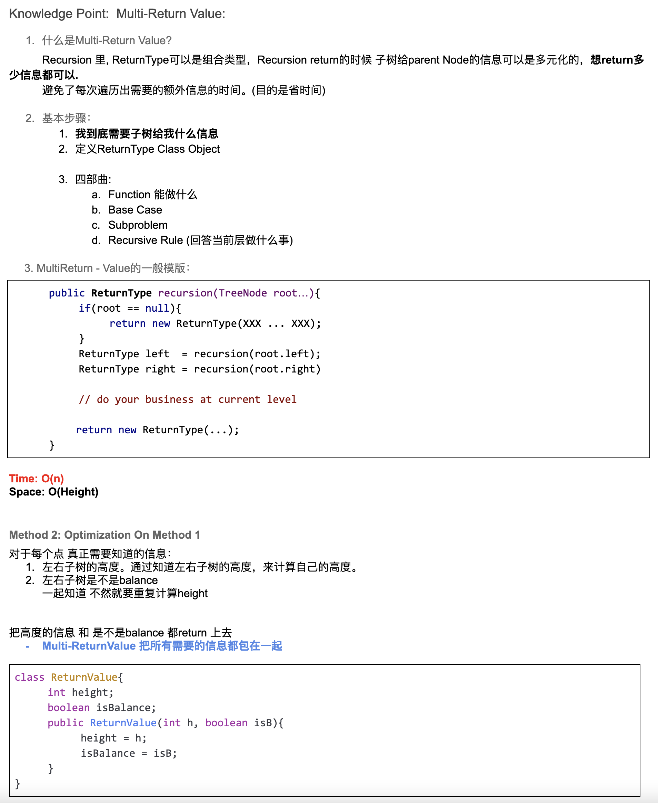

## 110. Balanced Binary Tree 


---


## Analysis:


```java
/**
 * Definition for a binary tree node.
 * public class TreeNode {
 *     int val;
 *     TreeNode left;
 *     TreeNode right;
 *     TreeNode() {}
 *     TreeNode(int val) { this.val = val; }
 *     TreeNode(int val, TreeNode left, TreeNode right) {
 *         this.val = val;
 *         this.left = left;
 *         this.right = right;
 *     }
 * }
 */
class Solution {
    public boolean isBalanced(TreeNode root) {
        if(root == null){
            return true;
        }
        int diff = getHeight(root.left) - getHeight(root.right);
        if(Math.abs(diff) > 1){
            return false;
        }
        return isBalanced(root.left) && isBalanced(root.right);
    }
    
    private int getHeight(TreeNode root){
      if (root == null) {
        return 0;
      }
      
      return Math.max(getHeight(root.left), getHeight(root.right)) + 1;
    }
    
}
```

---
## Anaylysis:

- 以上的写法是 `O(n logn)`, 
- What's the definition of `balanced`? It could be:
  - the tree has a `minimum` possible overall height
  - no leaf is too further away, i.e. `0` or `1`, from root than any other leaf
  - **left and right sub-tree have similar height,** i.e. difference is `0` or `1`
    (balanced height)

- how many levels in this recursion tree = `log n`
  total time = `O(nlogn)`
- space = `O(n)`


#### space complexity

关于space 

- 还有就是在一个method的stack frame里继续进行另一个method的call stack操作，
  这种情况的space complexity应该如何计算？

- space在每次使用完之后其实被释放了，所以其实是`logn`
  一般来说当recursive返回时，之前的space已经被释放了，可以理解为取最大值就是`space complexity`

- java在执行的时候只有一个stack，stack在执行的时候累进的，但是你从root开始，
  到第二层继续执行recursive，接着下到更下一层，

- 这时候你stack上其实只有两层。你可以理解为stack是一组大楼，root占据了第一层，
  然后以最左边的节点root的recursive占据了第二层，

- 继续累进执行。在你完成以最左子节点为root的累进执行前，其实root为节点的recursive只有第一层被他使用了。
  直到recursive本身进行的recursive执行完毕，才开始由root的getHeight function使用stack进行
  recursive。

- 也就是说，没有开辟新的空间，stack只有一个


- 从这里可以看出，递归是先从左子树开始探寻计算其高度，然后触发base case, 才开始探寻右子数
- 当触发了base case: ` if (root == null) {return 0;}`, 开始return, 递归回到上一层状态，
  但是： current.right is null, 所以触发 null pointer execption, 但是反复几次以后开始向右子树探寻


---

## Determine whether a binary tree is a balanced binary tree (O(n) solution)
- Time = O(n)
- Space = O(height)

- Step 1: 
  - ask for whether the left subtree is balanced and the height of the left subtree
  - ask for whether the right subtree is balanced and the height of the right subtree
- Step 2:
  - left is balanced and right is balanced
  - abs(left height - right height) <= 1
- Step 3:
  - return whether the subtree rooted at me balanced and the height of the subtree rooted at me
  
---

- Way of thinking(Tricks)
  - 1. What do you expect from your leftChild / rightChild? (usually it is the return type of the recursion function)
    - Two meanings: >= 0 : height(lchild); -1 : lchild is not balanced
    - Two meanings: >= 0 : height(rchild); -1 : rchild is not balanced
  - 2. **What do you want to do in the current layer?**
    - Case 1: if lchild is not balanced or rchild is not balanced, then return -1
    - Case 2: both balanced, check |height(child) - hight(child)| <= 1
  - 3. What do you want to report to your parent? (same as Q1 == Q3)
    - Two meanings: max(height(child), height(child)) + 1; or -1 if not balanced 


```java
public class Solution {
    public boolean isBalanced(TreeNode root) {
        // Write your solution here
        if(root == null){
          return true;
        }
        
        //use -1 to denote the tree is not balanced
        // >= 0 value means the tree is balanced and it is the height of the tree
        return getHeight(root) != -1;
    }
  
    private int getHeight(TreeNode root){
        if(root == null){
          return 0;
        }
        int leftHeight = getHeight(root.left);
        //if left subtree is already not balanced, we do not need to continue
        //and we can return -1 directly.
        if(leftHeight == -1){
          return -1;
        }
        int rightHeight = getHeight(root.right);
        if(rightHeight == -1){
          return -1;
        }

        //if not balanced, return -1
        if(Math.abs(leftHeight - rightHeight) > 1){
          return -1;
        }
        return Math.max(leftHeight, rightHeight) + 1;
    }
}
```

---

### Multi-ReturnValue





```java
class BalancedBinaryTree_Multi_ReturnValue {
    static class ReturnValue {
        int height;
        boolean isBalance;

        ReturnValue(int h, boolean isBalance) {
            this.height = h;
            this.isBalance = isBalance;
        }
    }

    public boolean isBalanced(TreeNode root) {
        if (root == null) {
            return true;
        }
        ReturnValue result = recursion(root);
        return result.isBalance;
    }

    private ReturnValue recursion(TreeNode root) {
        if (root == null) {
            return new ReturnValue(0, true);
        }
        ReturnValue left = recursion(root.left);
        ReturnValue right = recursion(root.right);

        int curHeight = Math.max(left.height, right.height) + 1;
        boolean curIsBalance = false;

        if (left.isBalance && right.isBalance &&
                Math.abs(left.height - right.height) <= 1) {
            curIsBalance = true;
        }
        return new ReturnValue(curHeight, curIsBalance);
    }
}
```
