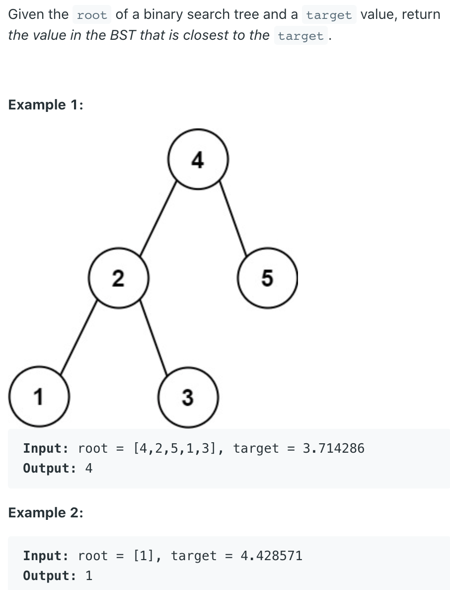

## 270. closest binary search tree value I


```java
/**
 * Definition for a binary tree node.
 * public class TreeNode {
 *     int val;
 *     TreeNode left;
 *     TreeNode right;
 *     TreeNode() {}
 *     TreeNode(int val) { this.val = val; }
 *     TreeNode(int val, TreeNode left, TreeNode right) {
 *         this.val = val;
 *         this.left = left;
 *         this.right = right;
 *     }
 * }
 */
class Solution {
    public int closestValue(TreeNode root, double target) {
        int res = root.val;
        while (root != null) {
            if (root.val == target) {
                return (int)target;
            }
            if (Math.abs(res - target) > Math.abs(root.val - target)) {
                res = root.val;
            }
            if (root.val > target) {
                root = root.left;
            } else {
                root = root.right;
            }
        }
        return res;
    }
}
```