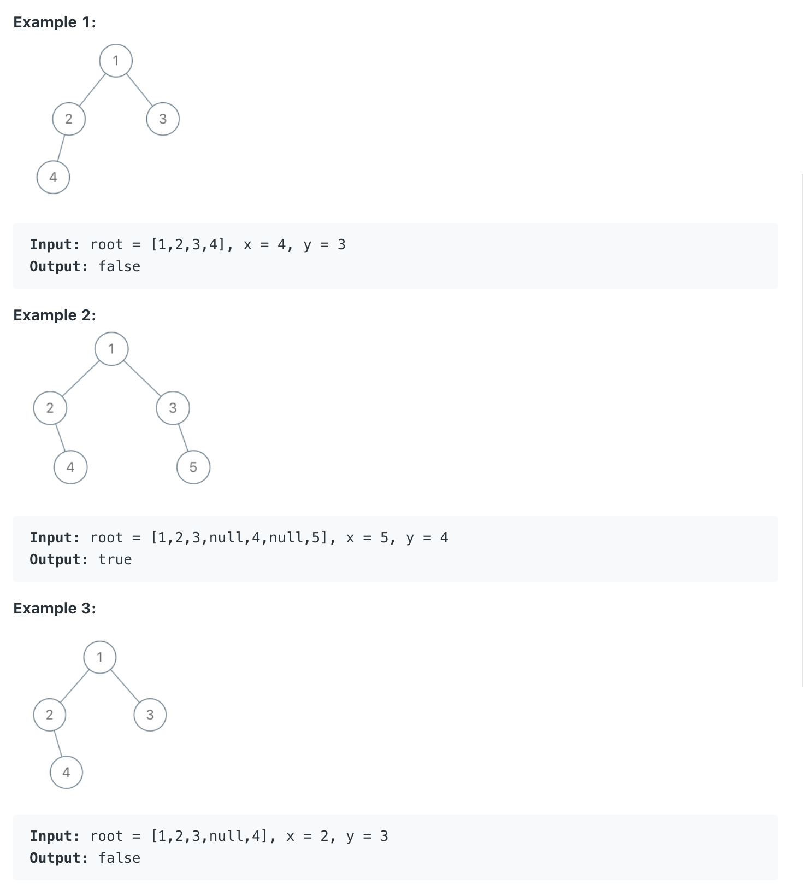

# 993. Cousins in Binary Tree

```ruby
In a binary tree, the root node is at depth 0, and children of each depth k node are at depth k+1.

Two nodes of a binary tree are cousins if they have the same depth, but have different parents.

We are given the root of a binary tree with unique values, 
and the values x and y of two different nodes in the tree.

Return true if and only if the nodes corresponding to the values x and y are cousins.
```




- Time = O(n)
- space = O(h), it's the depth of `dfs` recursion, where h is the hegiht of the binary tree

```java
/**
 * Definition for a binary tree node.
 * public class TreeNode {
 *     int val;
 *     TreeNode left;
 *     TreeNode right;
 *     TreeNode() {}
 *     TreeNode(int val) { this.val = val; }
 *     TreeNode(int val, TreeNode left, TreeNode right) {
 *         this.val = val;
 *         this.left = left;
 *         this.right = right;
 *     }
 * }
 */
class Solution {
    TreeNode xParent = null;
    TreeNode yParent = null;
    int xDepth = -1;
    int yDepth = -2;
    public boolean isCousins(TreeNode root, int x, int y) {
        dfs(root, null, x, y, 0);
        return xDepth == yDepth && xParent != yParent;
    }
    
    private void dfs(TreeNode root, TreeNode parent, int x, int y, int depth){
        if(root == null){
            return;
        }
        if(root.val == x){
            xParent = parent;
            xDepth = depth;
        }else if(root.val == y){
            yParent = parent;
            yDepth = depth;            
        }
        
        dfs(root.left, root, x, y, depth + 1);
        dfs(root.right, root, x, y, depth + 1);
    }
}
```