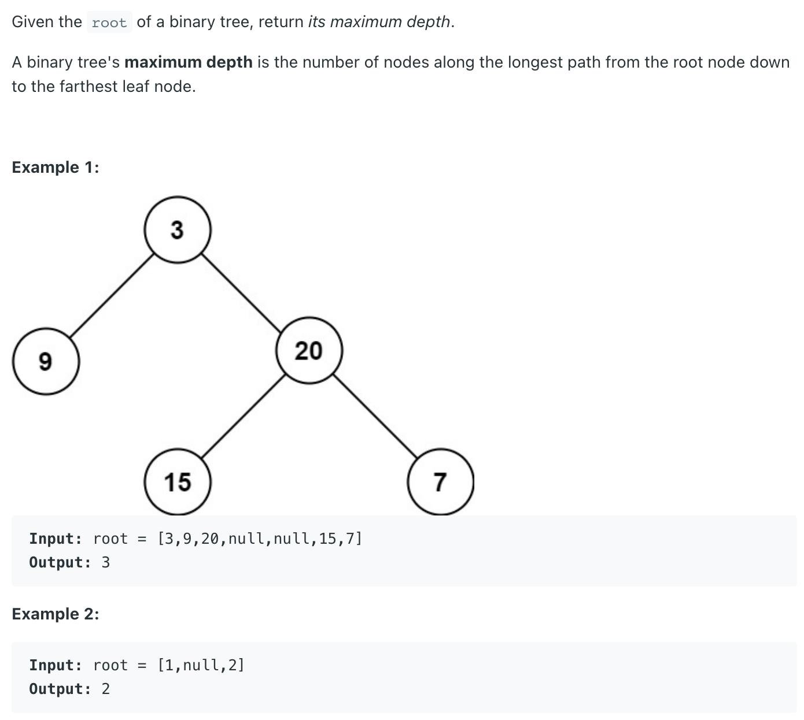
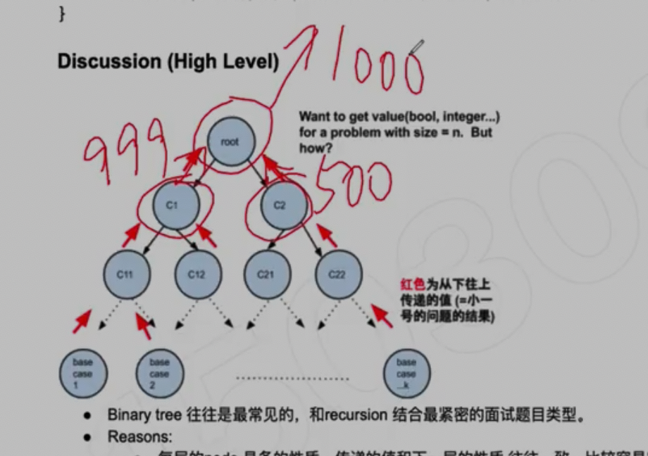

## 104. Maximum Depth of Binary Tree

---

## Analysis:

- [关于recursion tree time and space complexity analysis](https://novemberfall.github.io/LeetCode-NoteBook/#/Recursion/recursionTime)



- 不包括root, 因为递归往下走，往上值传递， return max() 比较左右subtree 的高度， return => 最大高度
- 最后得包含current root, current level的高度 => ans + 1.


- Time = `O(n)`,  n is the total number of nodes in the tree
- Space = `O(n)`, worst case, or `O(height)`


```java
/**
 * Definition for a binary tree node.
 * public class TreeNode {
 *     int val;
 *     TreeNode left;
 *     TreeNode right;
 *     TreeNode() {}
 *     TreeNode(int val) { this.val = val; }
 *     TreeNode(int val, TreeNode left, TreeNode right) {
 *         this.val = val;
 *         this.left = left;
 *         this.right = right;
 *     }
 * }
 */
class Solution {
    public int maxDepth(TreeNode root) {
        if (root == null) {
            return 0;
        }
        
        int leftNums = maxDepth(root.left);
        int rightNums = maxDepth(root.right);
        return Math.max(leftNums, rightNums) + 1;
    }
}
```