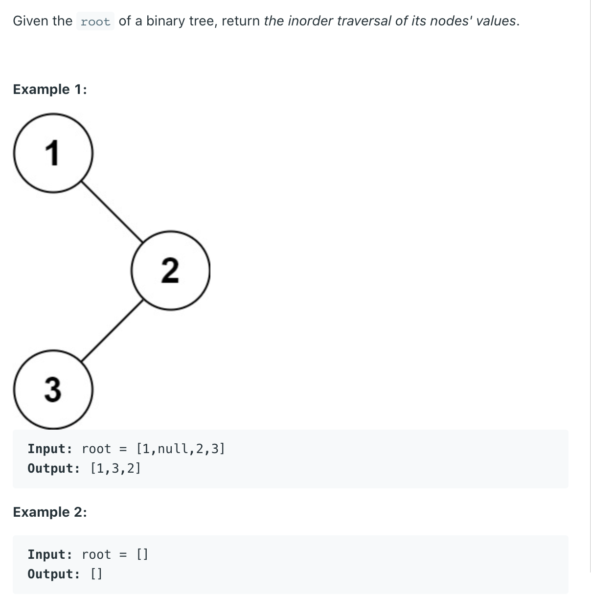

## 94. Binary Tree Inorder Traversal



```java
class BinaryTreeInorderTraversal_Iterator {
    static class TreeNode {
        int val;
        TreeNode left;
        TreeNode right;

        TreeNode() {
        }

        TreeNode(int val) {
            this.val = val;
        }

        TreeNode(int val, TreeNode left, TreeNode right) {
            this.val = val;
            this.left = left;
            this.right = right;
        }
    }

    public List<Integer> inorderTraversal(TreeNode root) {
        if (root == null) return new ArrayList<>();

        List<Integer> res = new ArrayList<>();
        Deque<TreeNode> stack = new ArrayDeque<>();
        TreeNode cur = root;
        while (cur != null || !stack.isEmpty()) {
            // always try go the left side to see if there is any node
            // should be traversed before the cur node, cur node is stored
            // on stack since it has not been traversed yet.
            while (cur != null) {
                stack.push(cur);
                cur = cur.left;
            }
            // if can't go left, meaning all the nodes on the side of
            // the top node on stack have been traversed, the next traverseing node
            // should be the top node on stack
            cur = stack.pop();
            res.add(cur.val);
            cur = cur.right;
        }
        return res;
    }

    public static void main(String[] args) {
        TreeNode root = new TreeNode(5);
        root.left = new TreeNode(2);
        root.right = new TreeNode(8);
        root.left.left = new TreeNode(1);
        root.left.right = new TreeNode(3);

        BinaryTreeInorderTraversal_Iterator btiti = new BinaryTreeInorderTraversal_Iterator();
        List<Integer> res = btiti.inorderTraversal(root);
        System.out.println(res);
        // [1   2   3   5   8]
    }
}
```

---
### Recursive

```java
class Solution {
    public List<Integer> inorderTraversal(TreeNode root) {
        if (root == null) {
            return new ArrayList<>();
        }
        
        List<Integer> res = new ArrayList<>();
        inorder(res, root);
        return res;
    }
    
    private void inorder(List<Integer> res, TreeNode root) {
        if (root == null) {
            return;
        }
        
        inorder(res, root.left);
        res.add(root.val);
        inorder(res, root.right);
    }
}
```