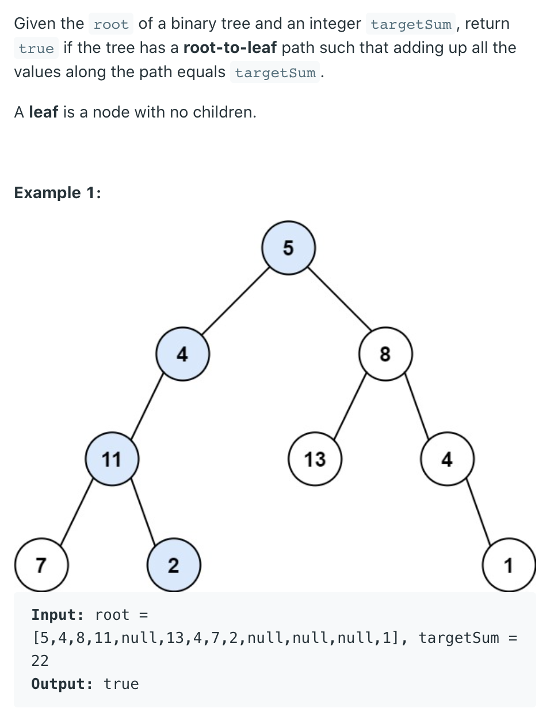
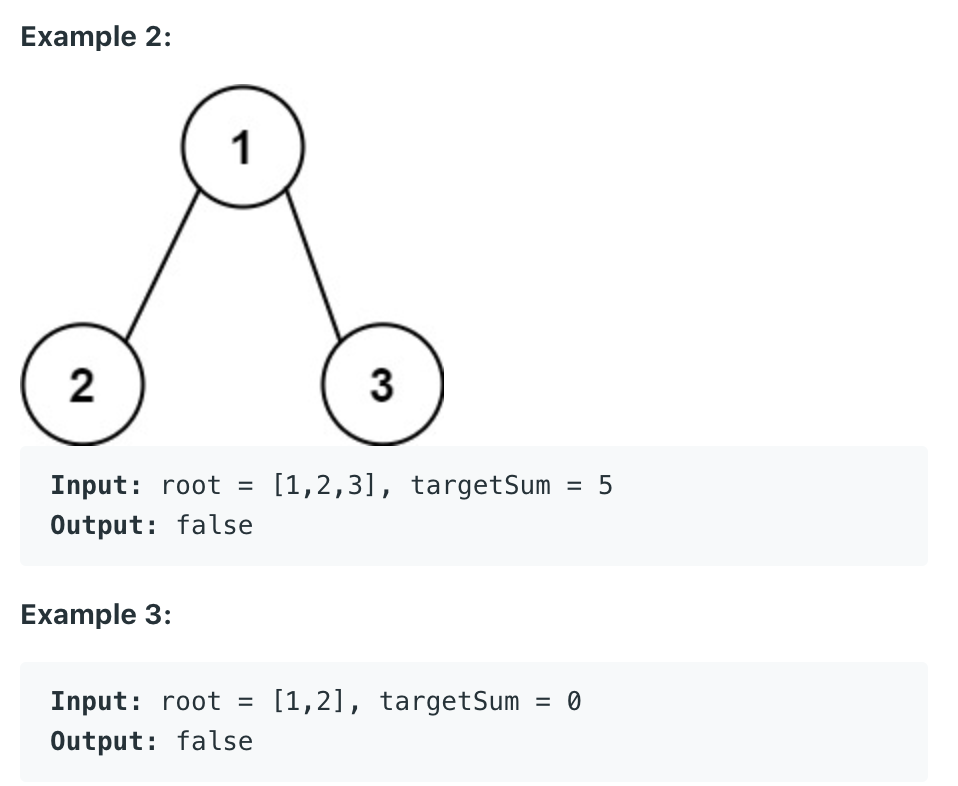

## 112. Path Sum





```java
/**
 * Definition for a binary tree node.
 * public class TreeNode {
 *     int val;
 *     TreeNode left;
 *     TreeNode right;
 *     TreeNode() {}
 *     TreeNode(int val) { this.val = val; }
 *     TreeNode(int val, TreeNode left, TreeNode right) {
 *         this.val = val;
 *         this.left = left;
 *         this.right = right;
 *     }
 * }
 */
class Solution {
    public boolean hasPathSum(TreeNode root, int targetSum) {
        if (root == null) {
            return false;
        }
        if (root.left == null && root.right == null) {
            return targetSum == root.val;
        } 
        return hasPathSum(root.left, targetSum - root.val) ||
               hasPathSum(root.right, targetSum - root.val);
    }
}
```