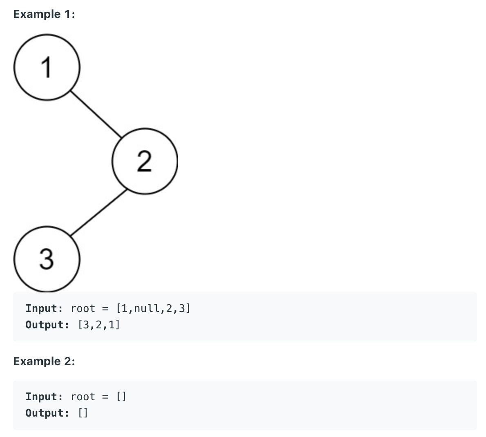

## 145. Binary Tree Postorder Traversal



```java
class BinaryTreePostorderTraversal_Iterator {
    static class TreeNode {
        int val;
        TreeNode left;
        TreeNode right;

        TreeNode() {
        }

        TreeNode(int val) {
            this.val = val;
        }

        TreeNode(int val, TreeNode left, TreeNode right) {
            this.val = val;
            this.left = left;
            this.right = right;
        }
    }

    // Post-Order is the reverse order of pre-order with traversing
    // right subtree before traversing left subtree.
    public List<Integer> postorderTraversal(TreeNode root) {
        if (root == null) return new ArrayList<>();

        List<Integer> res = new ArrayList<>();
        Deque<TreeNode> preOrder = new ArrayDeque<>();
        preOrder.push(root);
        while (!preOrder.isEmpty()) {
            TreeNode cur = preOrder.poll();
            res.add(cur.val);
            // in pre-order the right subtree will be traversed before the left
            // subtree so pushing left child first.
            if (cur.left != null) {
                preOrder.push(cur.left);
            }
            if (cur.right != null) {
                preOrder.push(cur.right);
            }
        }
        Collections.reverse(res);
        return res;
    }

    public static void main(String[] args) {
        TreeNode root = new TreeNode(5);
        root.left = new TreeNode(2);
        root.right = new TreeNode(8);
        root.left.left = new TreeNode(1);
        root.left.right = new TreeNode(3);

        BinaryTreePostorderTraversal_Iterator btpti = new BinaryTreePostorderTraversal_Iterator();
        List<Integer> res = btpti.postorderTraversal(root);
        System.out.println(res);
    }
}
```


---
### Recursive

```java
class Solution {
    public List<Integer> postorderTraversal(TreeNode root) {
        List<Integer> res = new ArrayList<>();
        if (root == null) {
            return res;
        }
        
        postorder(res, root);
        return res;
    }
    
    private void postorder(List<Integer> res, TreeNode root) {
        if (root == null) {
            return;
        }
        
        postorder(res, root.left);
        postorder(res, root.right);
        res.add(root.val);
    }
}
```