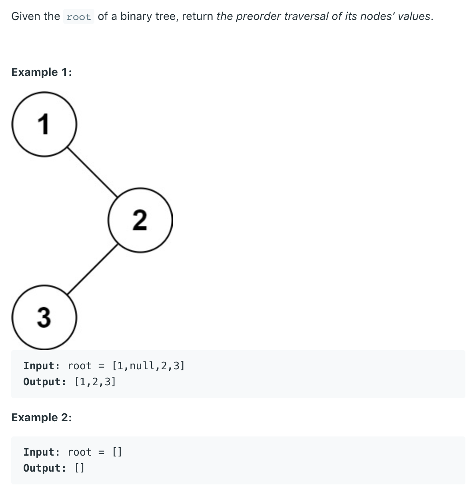

## 144. Binary Tree Preorder Traversal



- `Time O(n)`
- space: `O(H)` -- on call stack

```java
class BinaryTreePreorderTraversal_Iterator {
    static class TreeNode {
        int val;
        TreeNode left;
        TreeNode right;

        TreeNode() {
        }

        TreeNode(int val) {
            this.val = val;
        }

        TreeNode(int val, TreeNode left, TreeNode right) {
            this.val = val;
            this.left = left;
            this.right = right;
        }
    }

    public List<Integer> preorderTraversal(TreeNode root) {
        if (root == null) return new ArrayList<>();

        List<Integer> res = new ArrayList<>();
        Deque<TreeNode> stk = new ArrayDeque<>();
        stk.push(root);
        while (!stk.isEmpty()) {
            TreeNode cur = stk.pop();
            res.add(cur.val);
            if (cur.right != null) {
                stk.push(cur.right);
            }
            if (cur.left != null) {
                stk.push(cur.left);
            }
        }
        return res;
    }

    public static void main(String[] args) {
        TreeNode root = new TreeNode(5);
        root.left = new TreeNode(2);
        root.right = new TreeNode(8);
        root.left.left = new TreeNode(1);
        root.left.right = new TreeNode(3);

        BinaryTreePreorderTraversal_Iterator btpti = new BinaryTreePreorderTraversal_Iterator();
        List<Integer> res = btpti.preorderTraversal(root);
        System.out.println(res);
    }
}
```


---
### Recursive

```java
class Solution {
    public List<Integer> preorderTraversal(TreeNode root) {
        if (root == null) {
            return new ArrayList<>();
        }
        
        List<Integer> res = new ArrayList<>();      
        preorder(res, root);
        return res;
    }
    
    private void preorder(List<Integer> res, TreeNode root) {
        if (root == null) {
            return;
        }
        res.add(root.val);
        preorder(res, root.left);
        preorder(res, root.right);
    }
}
```