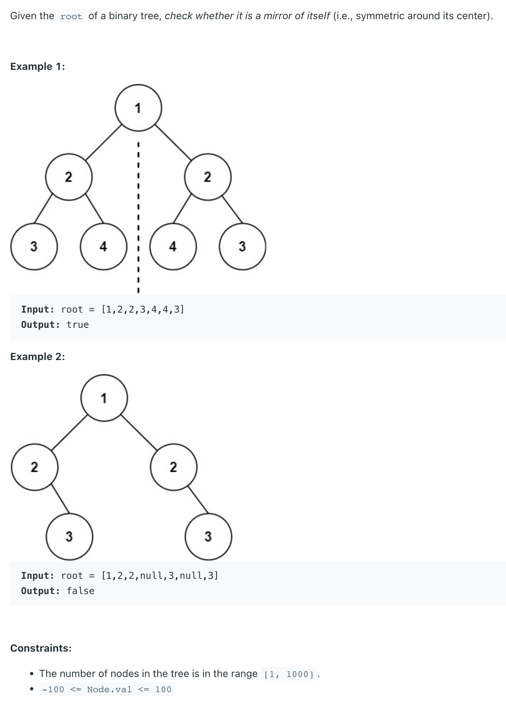
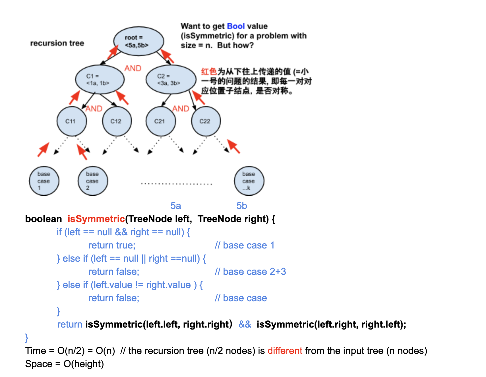

## 101. Symmetric Tree


---


## Analysis:




```java
/**
 * Definition for a binary tree node.
 * public class TreeNode {
 *     int val;
 *     TreeNode left;
 *     TreeNode right;
 *     TreeNode() {}
 *     TreeNode(int val) { this.val = val; }
 *     TreeNode(int val, TreeNode left, TreeNode right) {
 *         this.val = val;
 *         this.left = left;
 *         this.right = right;
 *     }
 * }
 */
class Solution {
    public boolean isSymmetric(TreeNode root) {
        if(root == null){
            return true;
        }
        
        return isSymmetric(root.left, root.right);
    }
    
    private boolean isSymmetric(TreeNode one, TreeNode two){
        if(one == null && two == null){
            return true;
        }else if(one == null || two == null){
            return false;
        }else if(one.val != two.val){
            return false;
        }
        
        return isSymmetric(one.left, two.right)
            && isSymmetric(one.right, two.left);
    }
}
```
---

```py
# Definition for a binary tree node.
# class TreeNode:
#     def __init__(self, val=0, left=None, right=None):
#         self.val = val
#         self.left = left
#         self.right = right
class Solution:
    def isSymmetric(self, root: Optional[TreeNode]) -> bool:
        if root is None:
            return True

        return self.symmetric(root.left, root.right)

    def symmetric(self, left, right):
        if left is None and right is None:
            return True
        if left is None or right is None:
            return False
        if left.val != right.val:
            return False

        return self.symmetric(left.left, right.right) and self.symmetric(left.right, right.left)
```