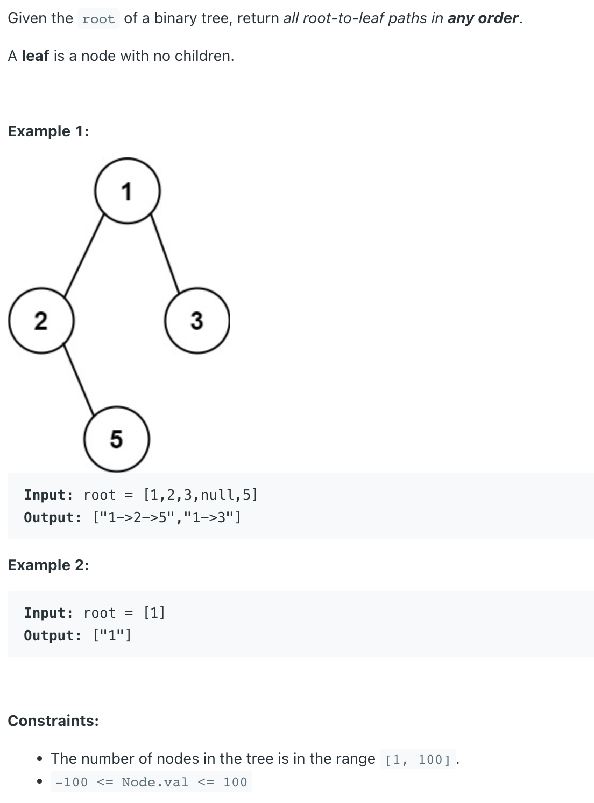

## 257. Binary Tree Paths



## Analysis:

- Time :
  - The time complexity for the problem should be O(n), since we are basically visiting each 
    node in the tree. Yet an interviewer might ask you for further optimization when he or she 
    saw a string concatenation. A string concatenation is just too costly. A `StringBuilder` 
    can be used although a bit tricky since it is not `immutable` like `string` is.

- Approach:
  - When using `StringBuilder`, We can just `keep track`of the `length` of the `StringBuilder` 
    before we `append` anything to it before recursion and afterwards set the length back. 
    Another trick is when to append the "->", since we don't need the `last arrow` 
    at the end of the string, we only **append it before recurse** to the next level of 
    the tree.


```java
/**
 * Definition for a binary tree node.
 * public class TreeNode {
 *     int val;
 *     TreeNode left;
 *     TreeNode right;
 *     TreeNode() {}
 *     TreeNode(int val) { this.val = val; }
 *     TreeNode(int val, TreeNode left, TreeNode right) {
 *         this.val = val;
 *         this.left = left;
 *         this.right = right;
 *     }
 * }
 */
class Solution {
    public List<String> binaryTreePaths(TreeNode root) {
        if(root == null){
            return new ArrayList<>();
        }
        List<String> res = new ArrayList<>();
        StringBuilder sb = new StringBuilder();
        dfs(res, sb, root);
        return res;
    }
    private void dfs(List<String> res, StringBuilder sb, TreeNode root){
        if(root == null){
            return;
        }
        int len = sb.length();
        sb.append(root.val);
        if(root.left == null && root.right == null){
            res.add(sb.toString());
        }else{
            sb.append("->");
            dfs(res, sb, root.left);
            dfs(res, sb, root.right);
        }
        sb.setLength(len);
    }
}
```


## 题型变种：

- 题目与leetCode 一样，但是要返回的类型改成 `String[]`, 那就需要在最后convert list to String array
  - `return list.toArray(new String[0])`
  - 或者你也可以进行一次 deep copy


```java
/**
 * public class TreeNode {
 *   public int key;
 *   public TreeNode left;
 *   public TreeNode right;
 *   public TreeNode(int key) {
 *     this.key = key;
 *   }
 * }
 */
public class Solution {
  public String[] binaryTreePaths(TreeNode root) {
    // Write your solution here
    if(root == null){
      return new String[0];
    }
    List<String> list = new ArrayList<>();
    StringBuilder sb = new StringBuilder();
    dfs(list, sb, root);
    // String[] res = new String[list.size()];
    // for(int i = 0; i < res.length; i++){
    //   res[i] = list.get(i);
    // }
    // return res;   
    return list.toArray(new String[0]);
  }
  
  private void dfs(List<String> res, StringBuilder sb, TreeNode root){
    if(root == null){
      return;
    }
    int len = sb.length();
    sb.append(root.key);
    if(root.left == null && root.right == null){
      res.add(sb.toString());
    }else{
      sb.append("->");
      dfs(res, sb, root.left);
      dfs(res, sb, root.right);
    }
    sb.setLength(len);
  }
}
```