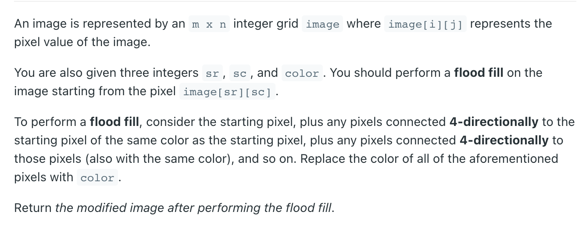
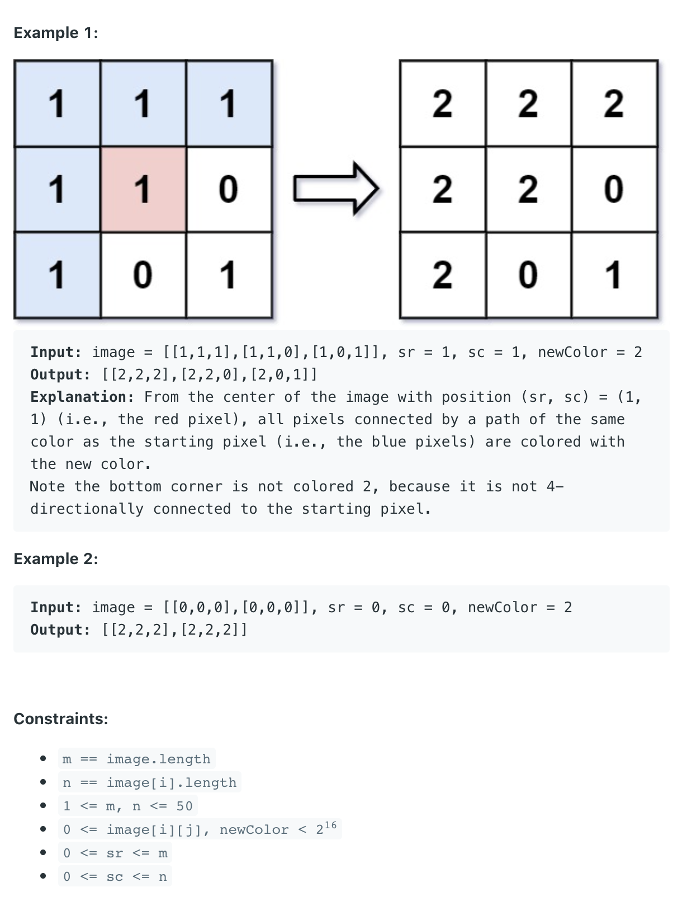

## 733. Flood Fill




- Time complexity: O(m*n), space complexity: O(m*n). 
  - m is number of rows, n is number of columns.

```java
class Solution {
    public int[][] floodFill(int[][] image, int sr, int sc, int newColor) {
        if (image[sr][sc] == newColor) {
            return image;
        }
        dfs(image, sr, sc, newColor, image[sr][sc]);
        return image;
    }
    
    private void dfs(int[][] image, int sr, int sc, int newColor, int oldColor) {
        if (sr < 0 || sc < 0 || sr >= image.length || sc >= image[0].length
           || oldColor != image[sr][sc]) {
            return;
        }
        image[sr][sc] = newColor;
        
        dfs(image, sr - 1, sc, newColor, oldColor);
        dfs(image, sr + 1, sc, newColor, oldColor);
        dfs(image, sr, sc - 1, newColor, oldColor);
        dfs(image, sr, sc + 1, newColor, oldColor);
    }
}
```