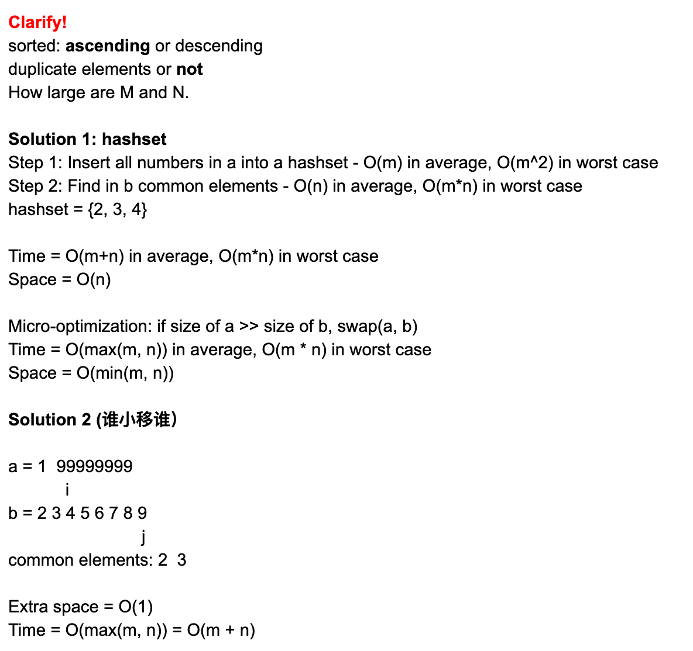

## 349. Intersection of Two Arrays


- Given two arrays, write a function to compute their intersection.
Example 1:

Input: nums1 = [1,2,2,1], nums2 = [2,2]
Output: [2]
Example 2:

Input: nums1 = [4,9,5], nums2 = [9,4,9,8,4]
Output: [9,4]
Note:

- Each element in the result must be unique.
  The result can be in any order.

---




```java
class Solution {
    public int[] intersection(int[] nums1, int[] nums2) {
        HashSet<Integer> set = new HashSet<>();
        HashSet<Integer> interset = new HashSet<>();
        
        for(Integer n : nums1){
            set.add(n);
        }
        
        for(int i = 0; i < nums2.length; i++){
            if(set.contains(nums2[i])){
                interset.add(nums2[i]);
            }
        }
        
        int[] result = new int[interset.size()];
        int index = 0;
        for(Integer j : interset){
            result[index++] = j;
        }
        return result;
    }
}
```