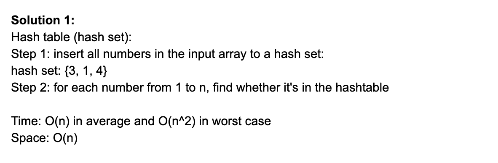
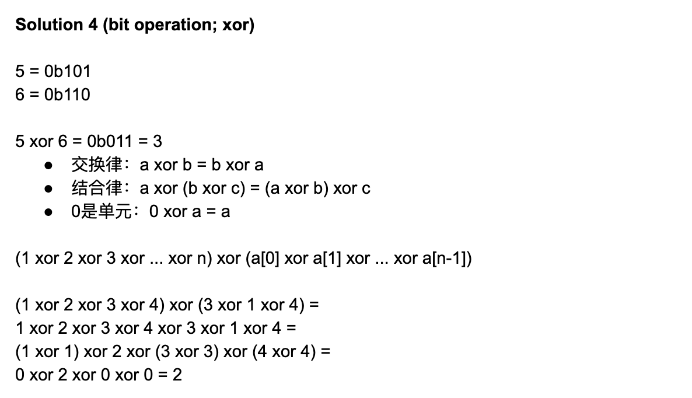
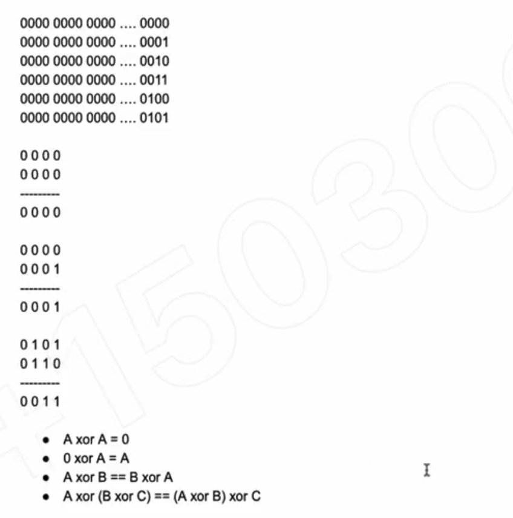

## 268. Missing Number

- Given an array nums containing n distinct numbers in the range [0, n], return the only 
  number in the range that is missing from the array.

- Follow up: Could you implement a solution using only O(1) extra space complexity and O
  (n) runtime complexity?

---



```java
class Solution {
    public int missingNumber(int[] nums) {
        if(nums == null || nums.length == 0){
            return 1;
        }
        
        HashSet<Integer> set = new HashSet<>();
        for(Integer num : nums){
            set.add(num);
        }
        
        int n = nums.length + 1;
        for(int i = 0; i < n; i++){
            if(!set.contains(i)){
                return i;
            }
        }
        return n;
    }
}
```

---




- A = [3, 1, 4]
- 3 xor 1 xor 4        => res1
- 1 xor 2 xor 3 xor 4  => res2
- res1 xor res2        => missing number

- Pros: time = O(n) space = O(1)
- Cons: none


```java
class Solution {
    public int missingNumber(int[] nums) {
        
        int len = nums.length;
        int res1 = 0;
        for (int i = 0; i < len; i++) {
            res1 ^= nums[i];
        }
        
        int res2 = 0;
        for (int i = 1; i <= len; i++) {
            res2 ^= i;
        }
        
        return res1 ^ res2;
    }
}
```