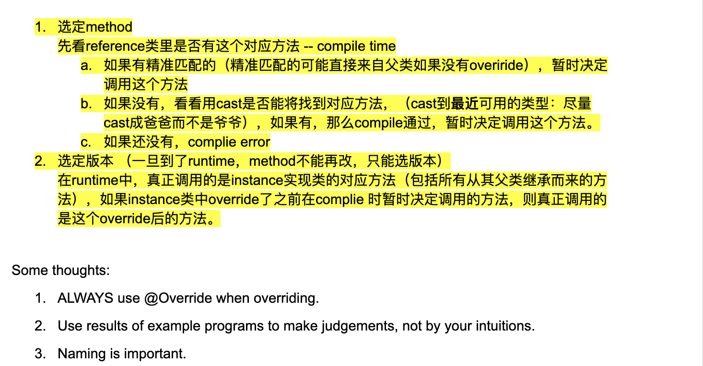

# Interface, Abstract class,Access Modifier,Exceptions

## Interface

- Definitions: A class that is derived from another class is called a `subclass` (also derived class,
  extended class, or child class). The class from which the subclass is derived is called a `superclass`
  (also a base class or parent class).


- Example:

```java
package derived;
public class Person {
    public final String name;
    private int age;
    public String getName(){ return name; }
    public int getAge(){ return age; }
    public void setAge(int age){ this.age = age; }
    public Person(String name){
        this.name = name;
    }
}

class Employee extends Person{
    public String company;
    public void setCompany(String company){ this.company = company; }
    public String getCompany(){ return company; }
    public Employee(String name){
        super(name);
    }
    public Employee(String name, String company){
        super(name);
        this.company = company;
    }
}

class Test{
    public static void main(String[] args) {
        Employee e = new Employee("John");
        String name = e.name;
        String name1 = e.getName();
        //int a = e.age;           // => No! age filed is private
        int a = e.getAge();
        String company = e.getCompany();
        
        Person p = new Employee("Jack");
        //int a = p.age;        // => No! age filed is private
        //String company = p.getCompany();           //No! Person doesn't have getCompany
    }
}
```

---

## Override vs Overload

- Override is when you redefine a method that has been defined in a parent class (using the 
  same signature). Resolved at runtime.


```java
package Override;

public class Person {
    public final String name;
    public String getName(){ return name; }
    public String getNameCard(){
        return name;
    }

    public Person(String name){
        this.name = name;
    }
}

class Employee extends Person{
    public String company;

    public Employee(String name) {
        super(name);
    }

    public void setCompany(String company){
        this.company = company;
    }

    public String getCompany() {
        return company;
    }

    public Employee(String name, String company) {
        super(name);
        this.company = company;
    }

    @Override
    public String getNameCard() {
        return name + ", " + company;
    }
}

class Test{
    public static void main(String[] args) {
        Employee e = new Employee("John");
        e.setCompany("Amazon");
        System.out.println(e.getNameCard());
        e.setCompany("Microsoft");
        System.out.println(e.getNameCard());
        System.out.println(e.getName());
    }
}

/* 
John, Amazon
John, Microsoft
John
 */
```

1. **哪些函数能够调用取决于reference的类型 -- compile**
2. **对于被override的函数，调用哪个版本，取决于object的类型 -- runtime**
- polymorphism

---

## Overload

- Overload is when you define two methods with the same name, in the same class, destinguished by 
  their signatures (different), Resolved at compile time.


```java
package Overload;

public class Person {
    public final String name;
    public String getName(){ return name; }
    public String getNameCard(){
        return name;
    }

    public Person(String name){
        this.name = name;
    }
}

class Employee extends Person{
    private int id;
    public String company;

    public Employee(String name) {
        super(name);
    }

    public void setCompany(String company){
        this.company = company;
    }

    public void setCompany(String company, int id){
        this.company = company;
        this.id = id;
    }

    @Override
    public String getNameCard() {
        return name + ", " + company + ", " + id;
    }
}

class Test{
    public static void main(String[] args) {
        Employee e = new Employee("John");
        e.setCompany("Amazon");
        System.out.println(e.getNameCard());
        e.setCompany("Microsoft", 666);
        System.out.println(e.getNameCard());
        System.out.println(e.getName());
    }
}

/* 
John, Amazon, 0
John, Microsoft, 666
John
 */
```

---

### More example:

```java
package practice;

class A {
    public String show(D obj) {
        return ("A and D");
    }

    public String show(A obj) {
        return ("A and A");
    }
}

class B extends A {
    public String show(B obj) {
        return ("B and B");
    }
    
    @Override
    public String show(A obj) {
        return ("B and A");
    }
}

class C extends B{}
class D extends B { }

class Test {
    public static void main(String[] args) {
        A a1 = new A();
        A a2 = new B();
        B b = new B();
        C c = new C();
        D d = new D();

        System.out.println("1--" + a1.show(b));//A and A
        System.out.println("2--" + a1.show(c));//A and A
        System.out.println("3--" + a1.show(d));//A and D
        System.out.println("4--" + a2.show(b));//B and A
        System.out.println("5--" + a2.show(c));//B and A
        System.out.println("6--" + a2.show(d));//A and D
        System.out.println("7--" + b.show(b));//B and B
        System.out.println("8--" + b.show(c));//B and B
        System.out.println("9--" + b.show(d));//A and D
    }
}
```

- Reference类型决定什么可以调用，Instance 类型决定调用的具体方法的行为
- 先看 reference 决定使用哪个函数的signature
- 再看implementation 决定使用哪个函数版本(function body)



---


## Interface vs abstract class

- A class must be declared abstract when it has one or more abstract methods. A method is declared
  abstract when it has a method heading, but no body - which means that an abstract method has no
  implementation code inside like normal methods do.


```java
package abstractInterface;

abstract class Figure {
    public abstract float getArea();
    public void print(){
        System.out.println("This is a Figure");
    }
}

class Circle extends Figure {
    private float radius;

    @Override
    public float getArea() {
        return (float) (3.14 * (radius * radius));
    }
}

class Rectangle extends Figure {
    private float length, width;

    @Override
    public float getArea() {
        return length * length;
    }
}

```


- An interface differs from an abstract class has only abstract methods 

```java
public interface CanBark {
    public void bark();
}

public class Husky implements CanBark {
    public void bark() {
        System.out.println("Wuuuuuuuuuuuuuuuuuuuuuuu!");
    }
}
```


