## Concurrency vs Parallel

- `Concurrency(并发)`: multiple tasks run **simultaneously**. Semantic concept, the “time” here 
  may be an abstract concept. You can’t tell who is first, who is second. You can’t tell the order 
  in general.

- Example: Friends eating together, two people leaving office at the same time, etc…
  In Java program: maybe a before b, maybe b before a, maybe same time---- I don’t know the order.

```java
for (Map.Entry<Integer, Integer> entry : map.entrySet()) { 
    // 1. Iterate the Map
   if (entry.getKey() != 2) {
       map.remove(entry.getKey()); // 2. Modify the map content
   }
}

ConcurrentModificationException
```


- 逻辑层面
- `Parallel(并行)`: multiple tasks **physically** run simultaneously. Implementation level concept
  In real time, there are at least two executors.
  Example: multilane(多车道) higway, multicore machines, hadoop clusters, ... 

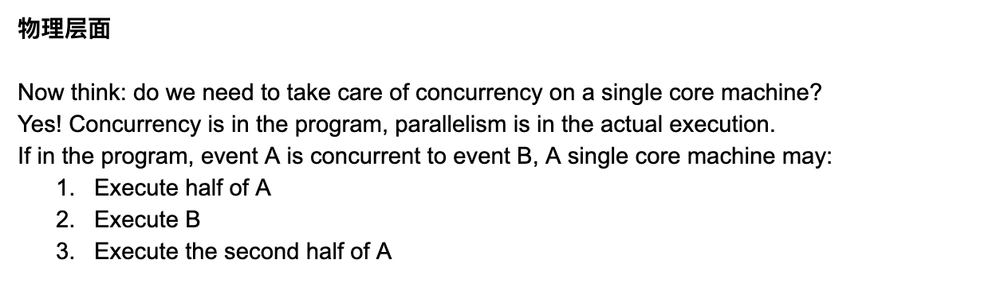


---

## Multi-process vs. Multi-thread

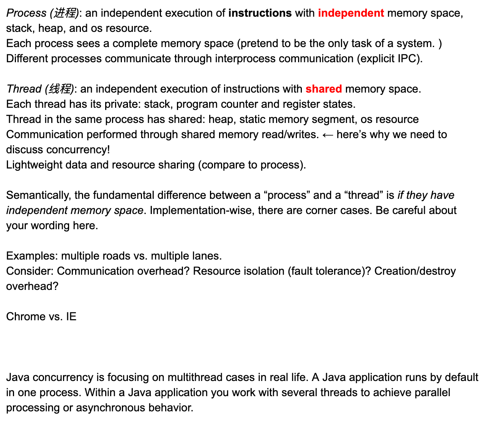

---

### Java Thread

- What is Thread in Java? How can we create threads and control their behaviors?
  In Java, everything is an OBJECT, so is Thread! If you need to create new threads helping you make
  your program concurrently, you have to 
  - create the threads objects
  - tell the threads what you want them to do
  - start the thread

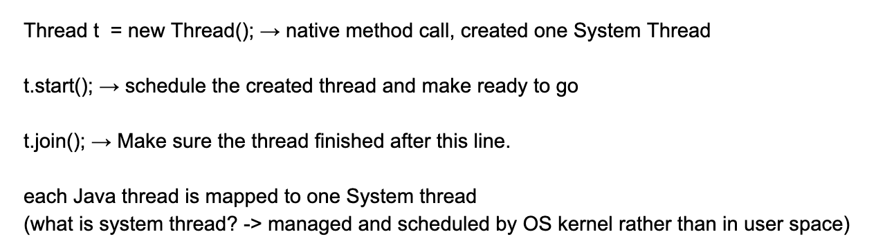
---

```java
public class myThread extends Thread{
    public static void main(String[] args) throws InterruptedException {
        myThread t = new myThread(){
            @Override
            public void run(){
                System.out.println("Hello 1");
            }
        };
        t.start(); //开始执行
        System.out.println("Hello 2");
        t.join();
        System.out.println("Hello 3");
    }
}
```

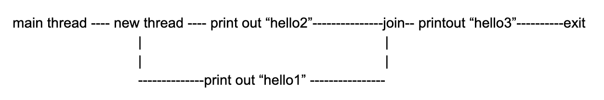

- `hello1`, `hello2` 打印顺序不一定，有时候1， 有时候2
  - `hello3` 一定是最后一个，原因在于 `join`

---

### without `join`


```java
    public static void main(String[] args) {
        Thread t = new Thread(){
            @Override
            public void run(){
                System.out.println("Hello1");
            }
        };
        t.start();
        System.out.println("Hello2");
    }
```

- 由于最后**默认**会有一句 `join`, 所以 `hello1`,`hello2` 都会打印 但是顺序不一样

- daemon(守护进程；后台程序) thread
- **When the JVM will exit? -> no alive non-daemon threads**

- 如何declare daemon?
  - [`setDaemon(boolean on)`](https://docs.oracle.com/javase/7/docs/api/java/lang/Thread.html#setDaemon(boolean)), 


---

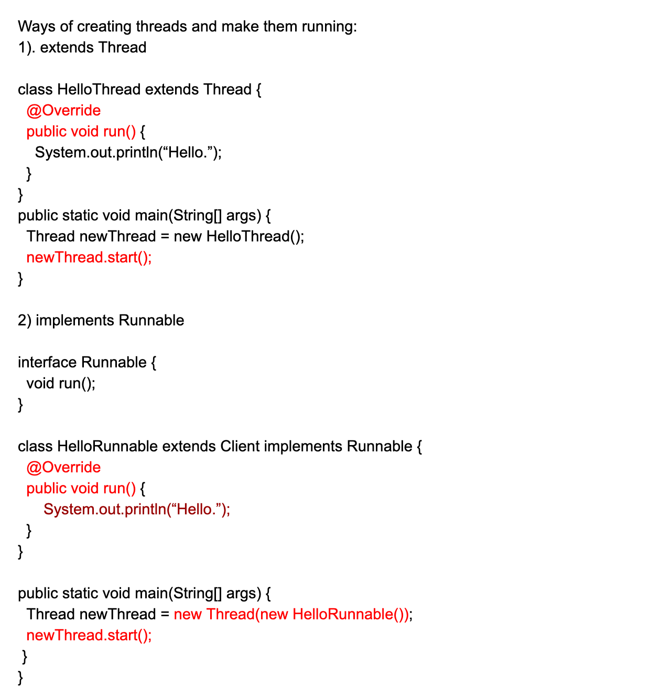

---

- `sleep(100)`
- `yield()` , 让道，学校门口，让对面的车走，上高速时候
  - **static method of Thread class**
- `Thread.sleep(1000)`
- `Thread.yield()`


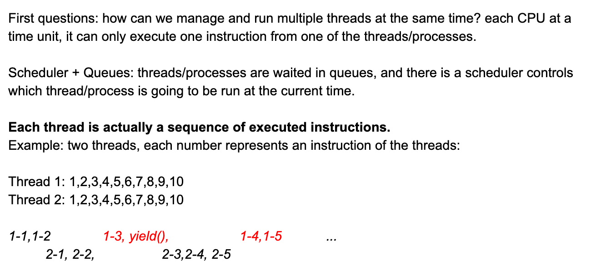

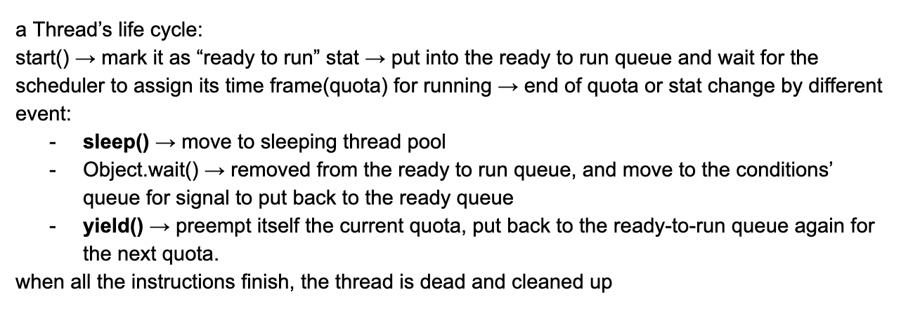

---

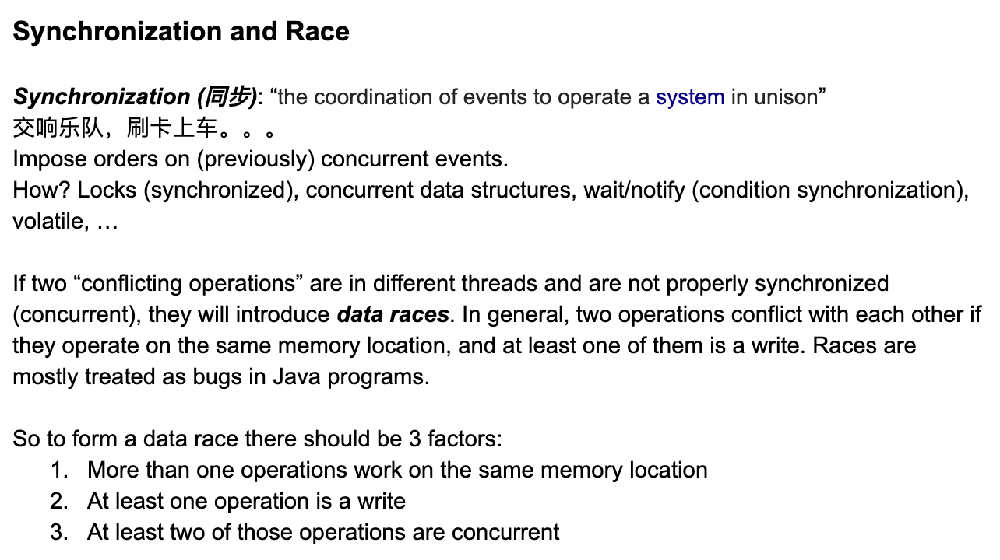

- 安排顺序，这就是同步，就是给不能分出顺序的事情，约束一下，分出顺序

```java
// Example 1
int a = 10;
Thread 1:
        a = 8;
Thread 2:
       int b = a + 1;         
// Is there a race?
(yes)


// Example 2:
int a = 10;
Thread 1:
      int b = a + 1;
Thread 2:
       int c = a + 4;         
// Is there a race?
(no)


// Example 3:
int a = 10;
Thread 1:
{
  int a = 10;
}

Thread 2:
{
  int a = 20
}   
// Is there a race?
(no)


public void test(){
  int a = 20;
  System.out.println(a);
}

new Thread(new Runnable(){
    @Override
    public void run(){
      test();
    }
});
```

- 银行取钱，`count++` 都是 data race, 全是并发

---

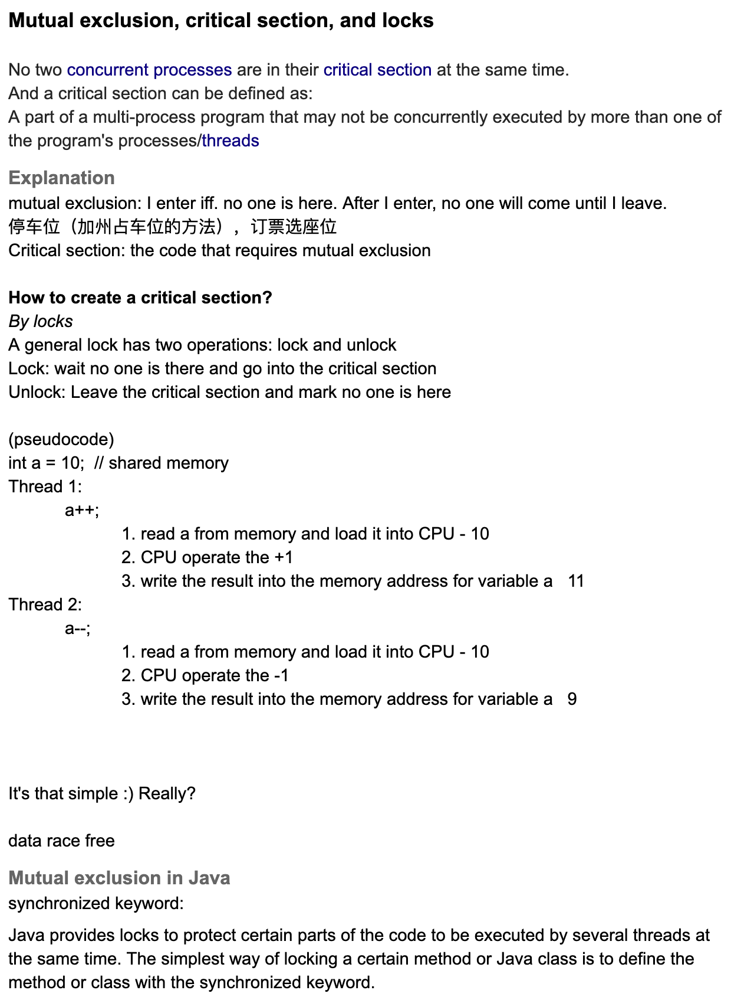
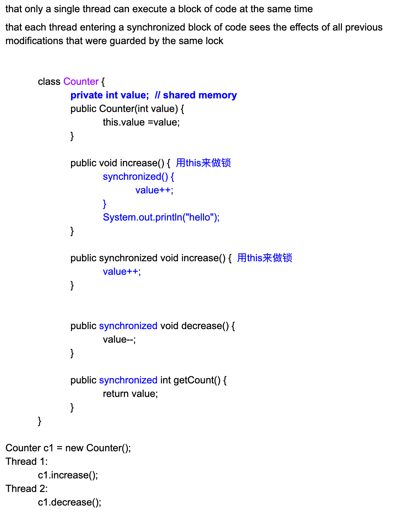

- 在有 `data race` 的情况下，我们用以下这段代码:

```java
// pseudocode
int a = 10;
Lock I = new Lock();
//Thread 1:
      I.lock();
      a++;
      I.unlock();
//Thread 2:
      I.lock();
      a--;
      I.unlock();      
```

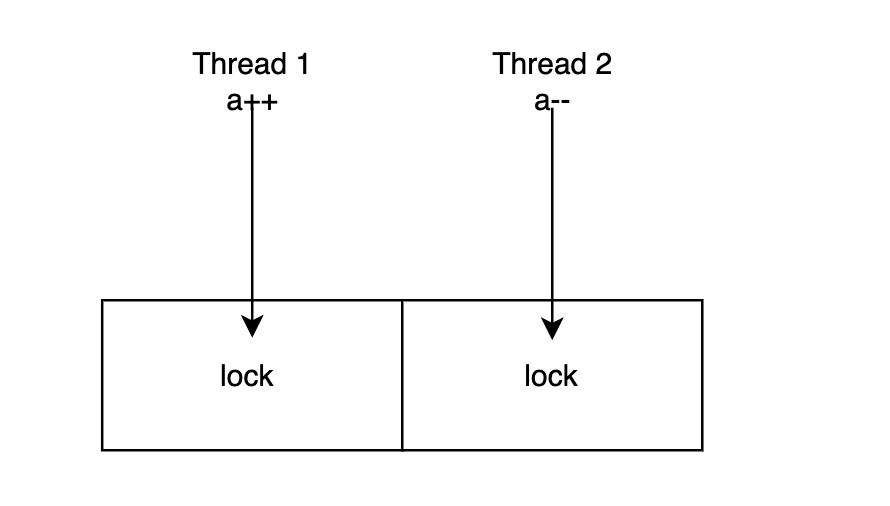

---

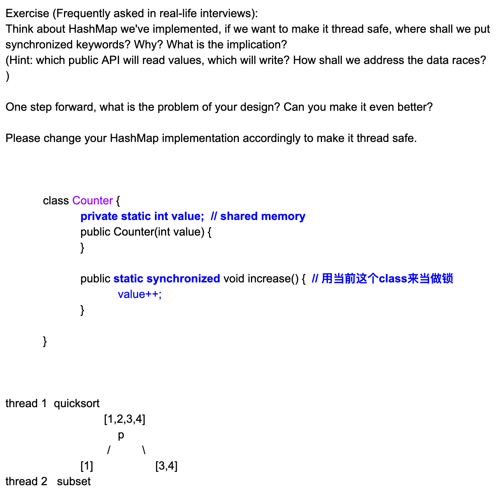

---

### Java 中， 如何 locking?

