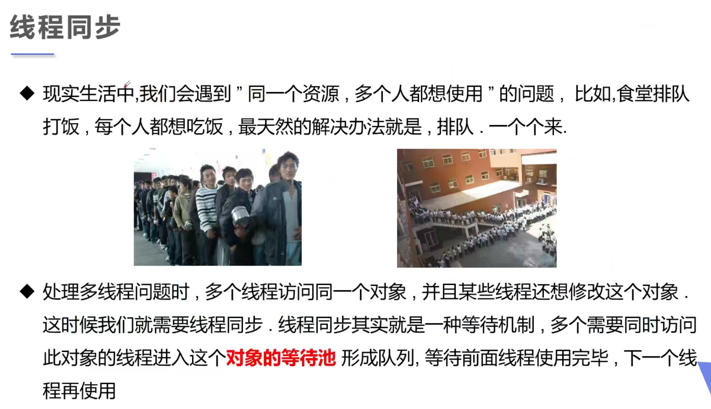
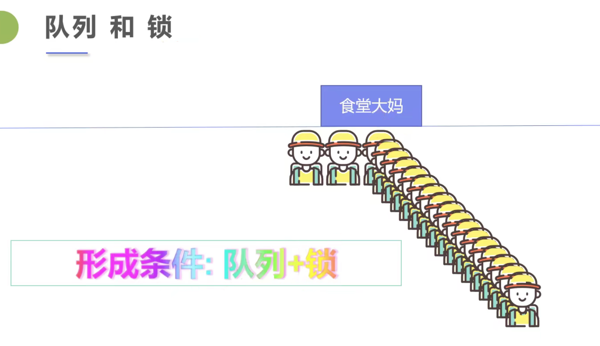
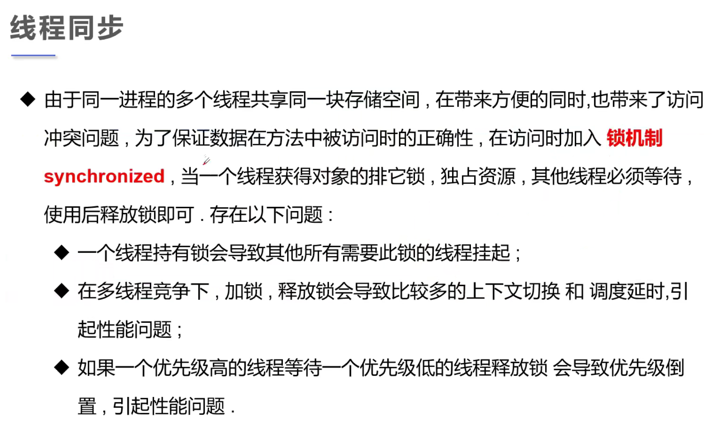
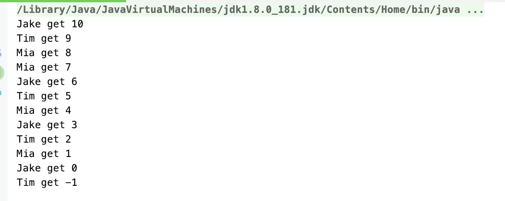
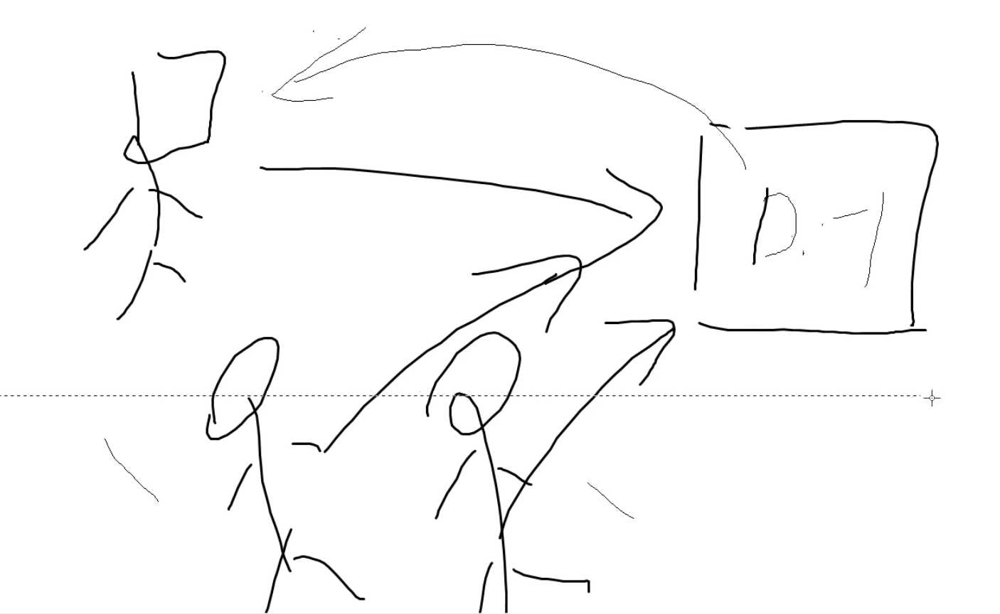
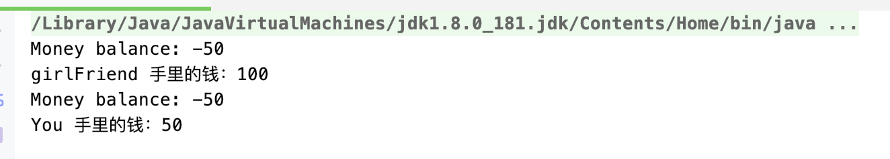

## 线程同步 | Concurrency

- 多个线程操作同一个资源








---

## 多个线程操作同一个资源, 会导致线程不安全

### 不安全的买票

```java
//不安全的购票
//线程不安全有负数
public class UnsafeBuyTickets {
    public static void main(String[] args) {
        BuyTicket buyTicket = new BuyTicket();

        new Thread(buyTicket, "Mia").start();
        new Thread(buyTicket, "Jake").start();
        new Thread(buyTicket, "Tim").start();
    }
}

class BuyTicket implements Runnable {
    // Ticket
    private int numsOfTickets = 10;
    boolean flag = true;//外部停止方法

    @Override
    public void run() {
        //买票
        while (flag) {
            try {
                purchase();
            } catch (InterruptedException e) {
                e.printStackTrace();
            }
        }
    }

    private void purchase() throws InterruptedException {
        //判断是否有票
        if (numsOfTickets <= 0) {
            flag = false;
            return;
        }
        //模拟延时
        Thread.sleep(100);

        // purchase ticket
        System.out.println(Thread.currentThread().getName() + " get " + numsOfTickets--);
    }
}
```





- 三个人同时购买最后那张票， `1--` => `0--` => `-1`  

---

### 不安全的取钱

```java
//不安全的取钱
//两个人去银行取钱，账户
public class UnsafeWithdraw {
    public static void main(String[] args) {
        Account account = new Account(100, "Money");
        Transaction you = new Transaction(account, 50, "You");
        Transaction girlFriend = new Transaction(account, 100, "girlFriend");

        you.start();
        girlFriend.start();
    }
}

//Account
class Account {
    int balance;
    String name;

    public Account(int balance, String name) {
        this.balance = balance;
        this.name = name;
    }
}

//bank; simulator withdraw
class Transaction extends Thread {

    Account account;
    int withDraw;
    int currentBalance;

    public Transaction(Account account, int withDraw, String name) {
        super(name);
        this.account = account;
        this.withDraw = withDraw;
    }

    //取钱
    @Override
    public void run() {
        if (account.balance - withDraw < 0) {
            System.out.println(Thread.currentThread().getName() + " Not enough balance!!");
            return;
        }

        //sleep可以检测到问题的根源
        try {
            Thread.sleep(1000);
        } catch (InterruptedException e) {
            e.printStackTrace();
        }

        //卡内余额 = 余额 - withdraw
        account.balance = account.balance - withDraw;

        //你手里的钱，包括你取出来的钱
        currentBalance = currentBalance + withDraw;
        System.out.println(account.name + " balance: " + account.balance);
        System.out.println(Thread.currentThread().getName() + " 手里的钱：" + currentBalance);
    }
}
```



---

### 线程不安全的集合

```java
//unsafe thread collection
public class UnsafeList {
    public static void main(String[] args) {
        List<String> list = new ArrayList<>();
        for (int i = 0; i < 10000; i++) {
            new Thread(() -> {
                list.add(Thread.currentThread().getName());
            }).start();
        }

        System.out.println(list.size());
    }
}

// 9980
```

- 可以看到并没有跑到10000个线程


