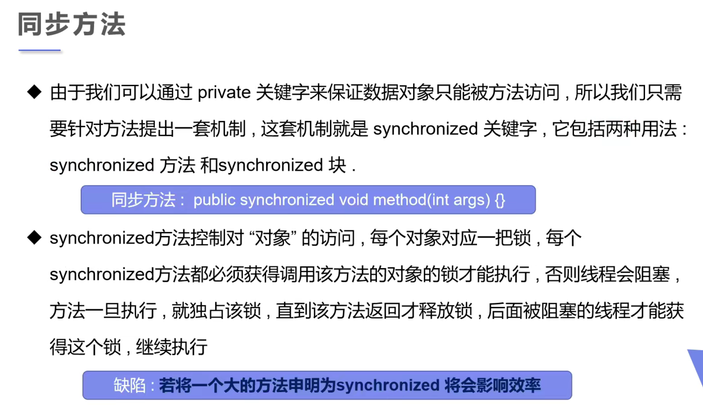
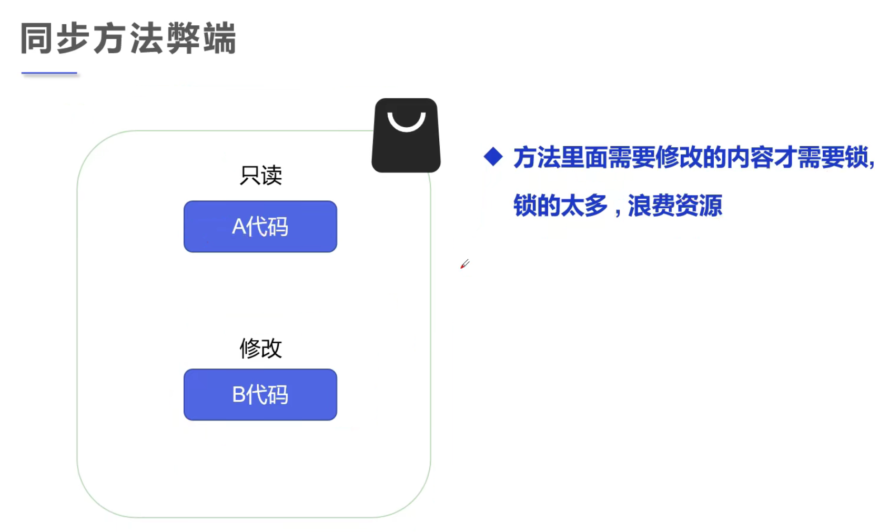
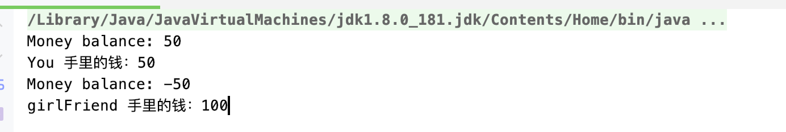
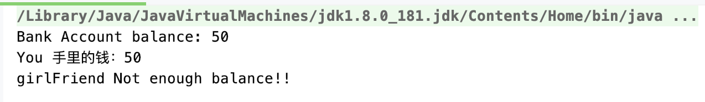
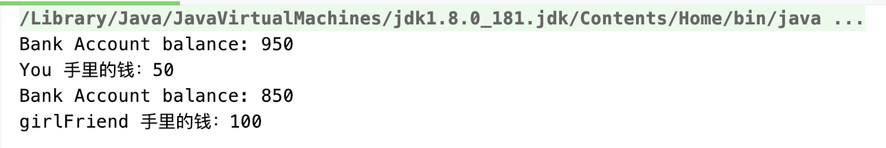

## 同步方法





---

### 之前我们已经讨论过，不安全的线程操作，现在我们加上 `Synchronized` 关键字，同步操作


```java
//安全的购票
public class SafeBuyTickets {
    public static void main(String[] args) {
        BuyTicket buyTicket = new BuyTicket();

        new Thread(buyTicket, "Mia").start();
        new Thread(buyTicket, "Jake").start();
        new Thread(buyTicket, "Tim").start();
    }
}

class BuyTicket implements Runnable {
    // Ticket
    private int numsOfTickets = 10;
    boolean flag = true;//外部停止方法

    @Override
    public void run() {
        //买票
        while (flag) {

            try {
                //模拟延时
                Thread.sleep(500);
                purchase();
            } catch (InterruptedException e) {
                e.printStackTrace();
            }
        }
    }

    //Synchronized Method
        //1。 用了synchronized, 每一个线程都会去拿锁，锁的是this => BuyTicket
    private synchronized void purchase() throws InterruptedException {
        //判断是否有票
        if (numsOfTickets <= 0) {
            flag = false;
            return;
        }

        // purchase ticket
        System.out.println(Thread.currentThread().getName() + " get " + numsOfTickets--);
    }
}
```

- 在`purchase()`里面invoke `sleep()`, 就是抱着锁睡觉，有可能睡醒了，释放锁以后，它又抢到执行权又开始执行
- 这里，`sleep()` 必须放在 `purchase()` 外面，假如放在`purchase()`里边, 会导致第一个线程在run里面不断调用
  `purchase()`, 直接买完所有的票，放在外面，直接`sleep()` 阻塞了，下一个线程就有机会了。


---

### 同步块

- 我们先 `synchronized` 方法试试:

```java
//两个人去银行取钱，账户
public class SafeWithdraw {
    public static void main(String[] args) {
        Account account = new Account(100, "Money");
        Transaction you = new Transaction(account, 50, "You");
        Transaction girlFriend = new Transaction(account, 100, "girlFriend");

        you.start();
        girlFriend.start();
    }
}

//Account
class Account {
    int balance;
    String name;

    public Account(int balance, String name) {
        this.balance = balance;
        this.name = name;
    }
}

//bank; simulator withdraw
class Transaction extends Thread {

    Account account;
    int withDraw;
    int currentBalance;

    public Transaction(Account account, int withDraw, String name) {
        super(name);
        this.account = account;
        this.withDraw = withDraw;
    }

    //取钱
    //synchronized 默认锁的是this，这里锁的是 Transaction, 于是我们需要同步块
    @Override
    public synchronized void run() {
        if (account.balance - withDraw < 0) {
            System.out.println(Thread.currentThread().getName() + " Not enough balance!!");
            return;
        }

        //sleep可以检测到问题的根源
        try {
            Thread.sleep(1000);
        } catch (InterruptedException e) {
            e.printStackTrace();
        }

        //卡内余额 = 余额 - withdraw
        account.balance = account.balance - withDraw;

        //你手里的钱，包括你取出来的钱
        currentBalance = currentBalance + withDraw;
        System.out.println(account.name + " balance: " + account.balance);
        System.out.println(Thread.currentThread().getName() + " 手里的钱：" + currentBalance);
    }
}
```



- 可以看到仍然不安全，还是有负数，我们需要`同步块`

- 由于前面的同步只能按方法去锁对象，但是这里具体操作`Transaction`的`withdraw` 的是new 的两个账户，我们要锁的是
  两个不同的对象，所以单纯在方法里加`synchronized`锁不到两个对象，所以才用同步块。

```java
//两个人去银行取钱，账户
public class SafeWithdraw {
    public static void main(String[] args) {
        Account account = new Account(100, "Bank Account");
        Transaction you = new Transaction(account, 50, "You");
        Transaction girlFriend = new Transaction(account, 100, "girlFriend");

        you.start();
        girlFriend.start();
    }
}

//Account
class Account {
    int balance;
    String name;

    public Account(int balance, String name) {
        this.balance = balance;
        this.name = name;
    }
}

//bank; simulator withdraw
class Transaction extends Thread {

    Account account;
    int withDraw;
    int currentBalance;

    public Transaction(Account account, int withDraw, String name) {
        super(name);
        this.account = account;
        this.withDraw = withDraw;
    }

    //取钱
    //synchronized 默认锁的是this，这里锁的是 Transaction, 于是我们需要同步块
    @Override
    public void run() {
        
        //锁的对象就是变化的量，需要增删改查的对象
        synchronized (account) {
            if (account.balance - withDraw < 0) {
                System.out.println(Thread.currentThread().getName() + " Not enough balance!!");
                return;
            }

            //sleep可以检测到问题的根源
            try {
                Thread.sleep(1000);
            } catch (InterruptedException e) {
                e.printStackTrace();
            }

            //卡内余额 = 余额 - withdraw
            account.balance = account.balance - withDraw;

            //你手里的钱，包括你取出来的钱
            currentBalance = currentBalance + withDraw;
            System.out.println(account.name + " balance: " + account.balance);
            System.out.println(Thread.currentThread().getName() + " 手里的钱：" + currentBalance);
        }
    }
}
```



---

- 把钱改成1000试试:

```java
    public static void main(String[] args) {
        Account account = new Account(1000, "Bank Account");
        Transaction you = new Transaction(account, 50, "You");
        Transaction girlFriend = new Transaction(account, 100, "girlFriend");

        you.start();
        girlFriend.start();
    }
```



---

### 最后再来修改 不安全线程的集合

- 继续使用 `sync block`

```java
//Safe thread collection
public class SafeList {
    public static void main(String[] args) throws InterruptedException {
        List<String> list = new ArrayList<>();
        for (int i = 0; i < 10000; i++) {
            new Thread(() -> {
                synchronized (list) {
                    list.add(Thread.currentThread().getName());
                }
            }).start();
        }

        Thread.sleep(3000);

        System.out.println(list.size());
    }
}

// 10000
```
