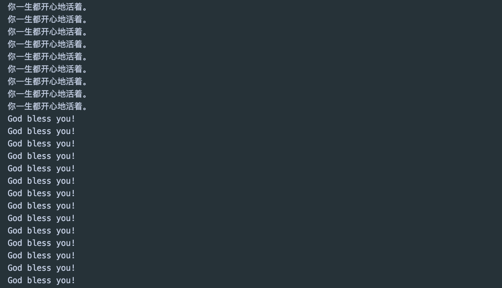
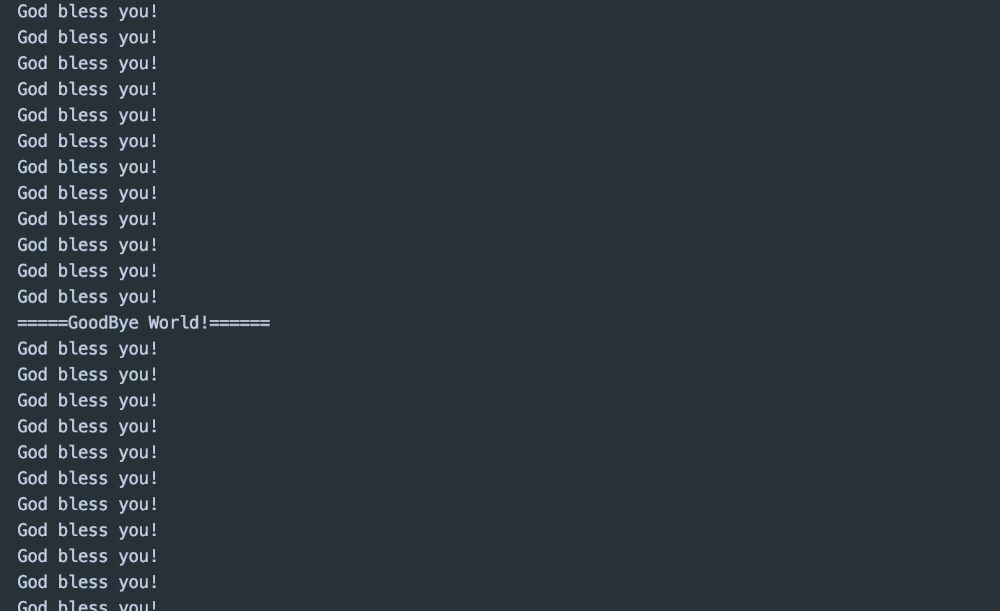

## daemon

- A daemon thread is a thread that does not prevent the JVM from exiting when the program finishes but 
  the thread is still running. An example for a daemon thread is the garbage collection. You can use the 
  `setDaemon(boolean)` method to change the Thread daemon properties before the thread starts.


```java
//上帝守护你
public class ThreadDaemon {
    public static void main(String[] args) {
        God god = new God();
        You you = new You();

        Thread thread = new Thread(god);
        thread.setDaemon(true);//默认是false => User Thread, 正常的线程都是User Thread

        thread.start();//God Proxy Start

        new Thread(you).start();//User Thread
    }
}

// God
class God implements Runnable {
    @Override
    public void run() {
        while (true) {
            System.out.println("God bless you!");
        }
    }
}

// You
class You implements Runnable {
    @Override
    public void run() {
        for (int i = 0; i < 36500; i++) {
            System.out.println("你一生都开心地活着。");
        }
        System.out.println("=====GoodBye World!======");
    }
}
```



