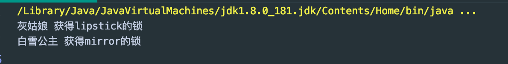
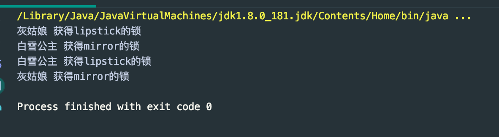

## DeadLock


- DeadLock: occurs when multiple threads need the same locks but get them in different order
- 多个线程互相抱着对方需要的资源，然后形成僵持

```java
public class DeadLock {
    public static void main(String[] args) {
        Makeup g1 = new Makeup(0, "灰姑娘");
        Makeup g2 = new Makeup(1, "白雪公主");

        g1.start();
        g2.start();
    }
}

//lipstick
class Lipstick {

}

//mirror
class Mirror {

}

class Makeup extends Thread {

    //需要的资源只有一份，用static来保证只有一份
    static Lipstick lipstick = new Lipstick();
    static Mirror mirror = new Mirror();

    int choice;
    String girlName;

    Makeup(int choice, String girlName) {
        this.choice = choice;
        this.girlName = girlName;
    }

    @Override
    public void run() {
        //makeup
        try {
            makeup();
        } catch (InterruptedException e) {
            e.printStackTrace();
        }
    }

    //化妆，互相持有对方的锁，需要拿到对方的资源
    private void makeup() throws InterruptedException {
        if (choice == 0) {
            synchronized (lipstick) {//获得口红的锁
                System.out.println(this.girlName + " 获得lipstick的锁");
                Thread.sleep(1000);

                synchronized (mirror) {//一秒钟后获得镜子的锁
                    System.out.println(this.girlName + " 获得mirror的锁");
                }
            }
        } else {
            synchronized (mirror) {//获得口红的锁
                System.out.println(this.girlName + " 获得mirror的锁");
                Thread.sleep(2000);

                synchronized (lipstick) {//2秒钟后获得镜子的锁
                    System.out.println(this.girlName + " 获得lipstick的锁");
                }
            }
        }
    }
}
```



- 现在已经形成一个死锁

- 现在让他们一个接一个拿锁

```java
    //化妆，互相持有对方的锁，需要拿到对方的资源
    private void makeup() throws InterruptedException {
        if (choice == 0) {
            synchronized (lipstick) {//获得口红的锁
                System.out.println(this.girlName + " 获得lipstick的锁");
                Thread.sleep(1000);
            }
            synchronized (mirror) {//一秒钟后获得镜子的锁
                System.out.println(this.girlName + " 获得mirror的锁");
            }
        } else {
            synchronized (mirror) {//获得口红的锁
                System.out.println(this.girlName + " 获得mirror的锁");
                Thread.sleep(2000);
            }
            synchronized (lipstick) {//2秒钟后获得镜子的锁
                System.out.println(this.girlName + " 获得lipstick的锁");
            }
        }
    }
```



- **以上注意： 如果没有sleep(), 线程A如果执行太快直接把两个锁都拿到了，就不会发生死锁现象，所以这里的sleep就是为了扩大错误发生率**


