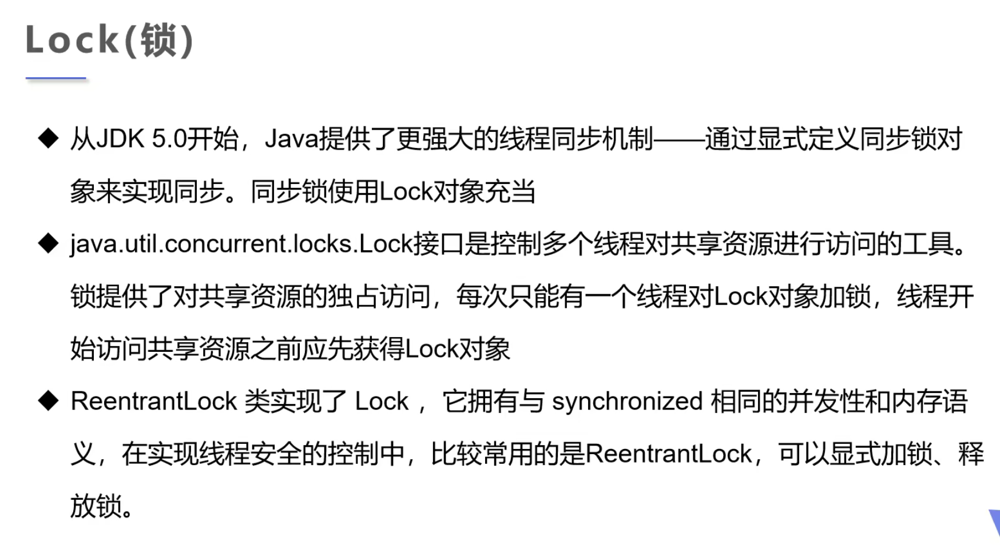
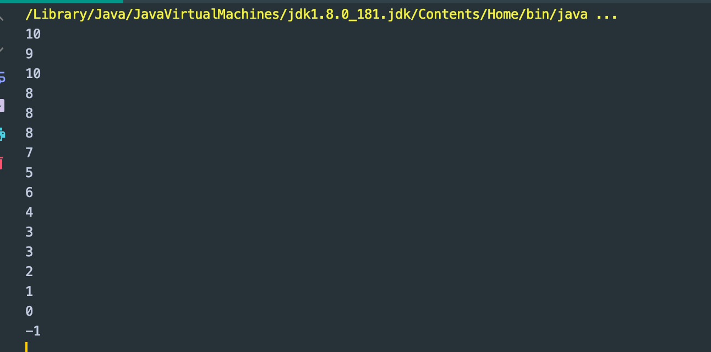
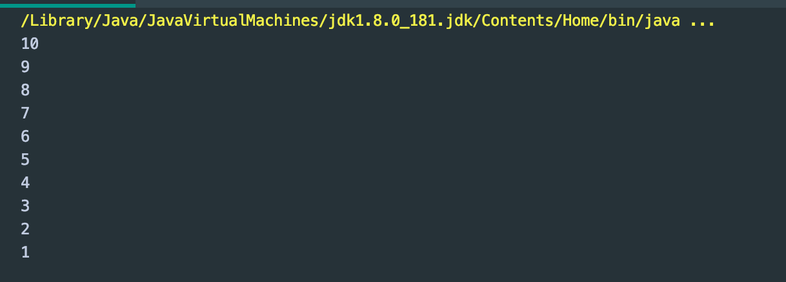
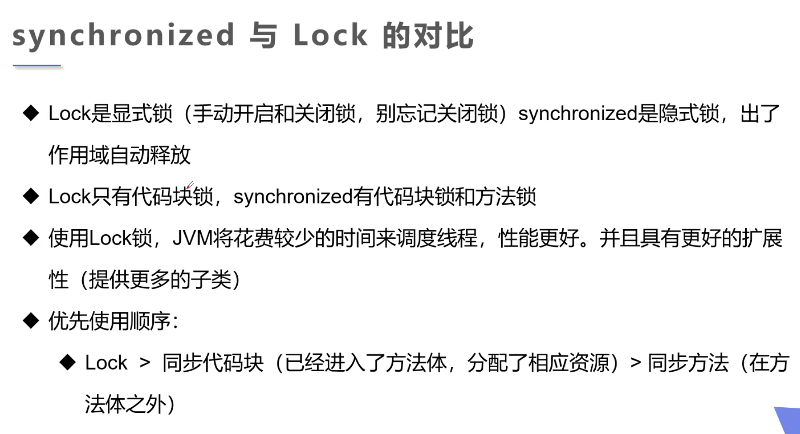
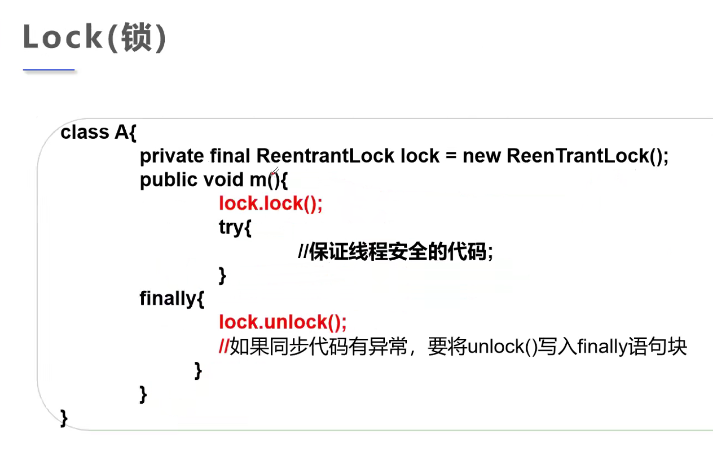

## Lock



- 不加锁，情况下来观察一下不安全线程操作：

```java
public class TestLock {

    public static void main(String[] args) {
        TestLock2 t2 = new TestLock2();
        new Thread(t2).start();
        new Thread(t2).start();
        new Thread(t2).start();
    }

    private static class TestLock2 implements Runnable {

        int numsOfTickets = 10;

        @Override
        public void run() {
            while (true) {
                if (numsOfTickets > 0) {
                    try {
                        Thread.sleep(1000);
                    } catch (InterruptedException e) {
                        e.printStackTrace();
                    }
                    System.out.println(numsOfTickets--);
                } else {
                    break;
                }
            }
        }
    }
}
```



- 看到负数，所以线程不安全

- `lock(), unlock()` 操作:

```java
public class TestLock {

    public static void main(String[] args) {
        TestLock2 t2 = new TestLock2();
        new Thread(t2).start();
        new Thread(t2).start();
        new Thread(t2).start();
    }

    private static class TestLock2 implements Runnable {

        int numsOfTickets = 10;

        //declare lock
        private final ReentrantLock Lock = new ReentrantLock();
        //ReentrantLock 可重复锁

        @Override
        public void run() {

            while (true) {
                try {
                    Lock.lock();//加锁
                    if (numsOfTickets > 0) {
                        try {
                            Thread.sleep(1000);
                        } catch (InterruptedException e) {
                            e.printStackTrace();
                        }
                        System.out.println(numsOfTickets--);
                    } else {
                        break;
                    }
                } finally {
                    //解锁
                    Lock.unlock();
                }
            }
        }
    }
}
```



- 可以看到这下就安全了.



