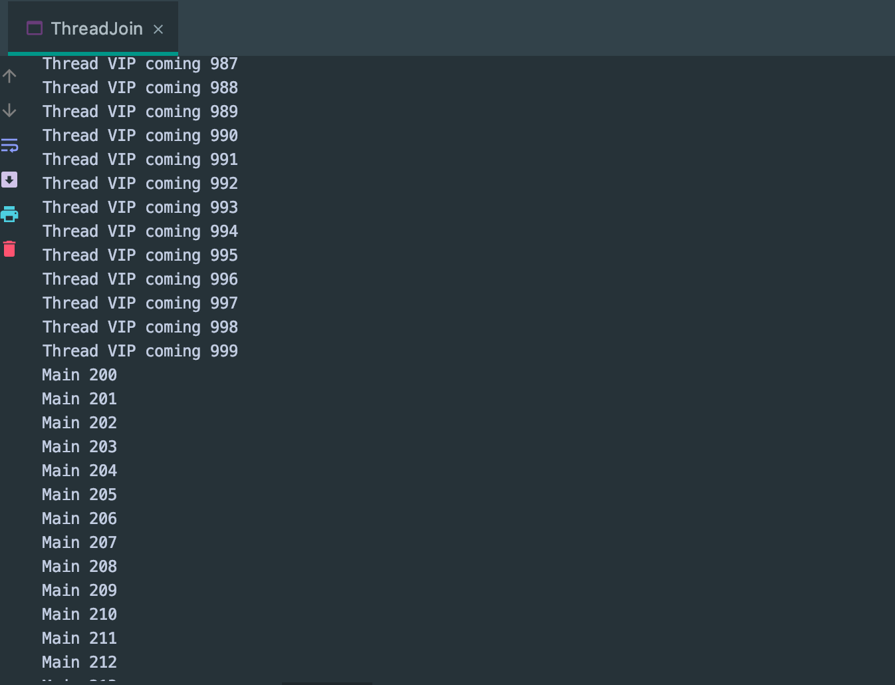

## 线程强制执行 join

- join 会使当前线程（此处是main method）等待调用join的进行执行完毕后再继续往下执行

```java
//想象为插队
public class ThreadJoin implements Runnable{
    @Override
    public void run() {
        for (int i = 0; i < 1000; i++) {
            System.out.println("Thread VIP coming " + i);
        }
    }

    public static void main(String[] args) throws InterruptedException {
        //启动我们的线程
        ThreadJoin threadJoin = new ThreadJoin();
        Thread thread = new Thread(threadJoin);
        thread.start();

        // Main thread
        for (int i = 0; i < 500; i++) {
            if (i == 200) {
                thread.join();//插队
            }
            System.out.println("Main " + i);
        }
    }
}
```

