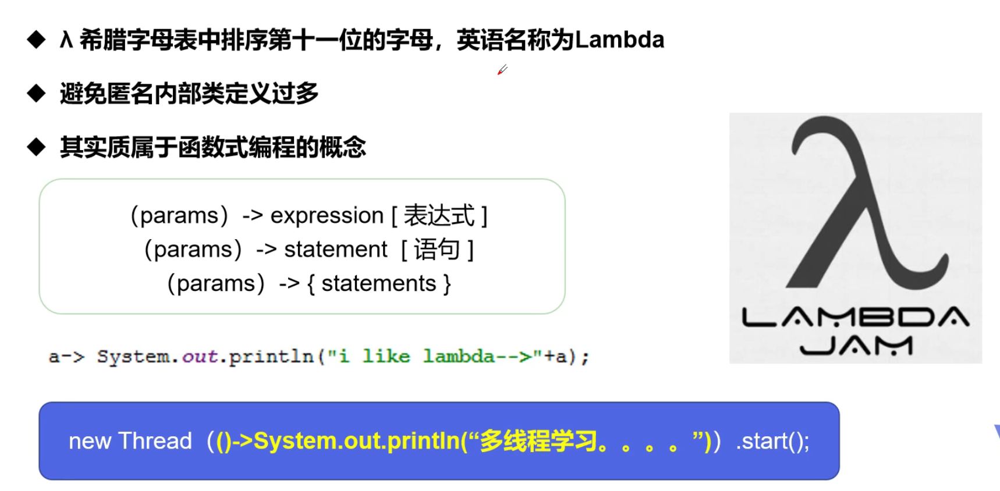
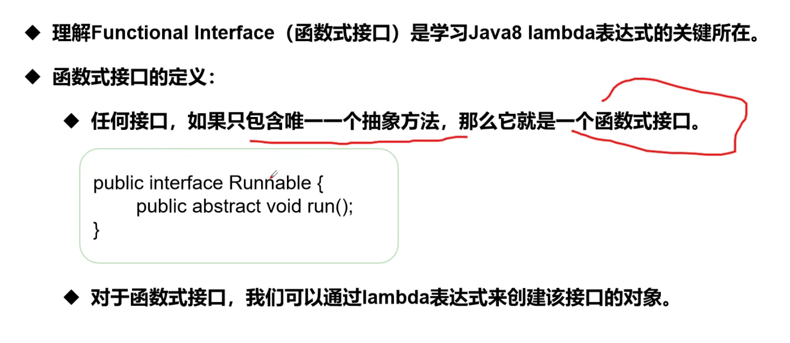

## Lambda Expression





---

```java
public class lambdaThread {

    // 3. static inner class
    static class Like2 implements ILike {
        @Override
        public void lambda() {
            System.out.println("I like lambda 2");
        }
    }


    public static void main(String[] args) {
        ILike like = new Like();
        like.lambda();

        like = new Like2();
        like.lambda();

        //4. 局部内部类
        class Like3 implements ILike {
            @Override
            public void lambda() {
                System.out.println("I like lambda 3");
            }
        }
        like = new Like3();
        like.lambda();

        //5. Anonymous inner class, 没有类的名称，必须借助interface
        like = new ILike() {
            @Override
            public void lambda() {
                System.out.println("I like lambda 4");
            }
        };
        like.lambda();

        //6. lambda expression
        like = () -> {
            System.out.println("I like lambda 5");
        };
        like.lambda();
    }
}

//1. declare an interface
interface ILike {
    void lambda();
}

//2. 实现类
class Like implements ILike {
    @Override
    public void lambda() {
        System.out.println("I like lambda");
    }
}

/*
        I like lambda
        I like lambda 2
        I like lambda 3
        I like lambda 4
        I like lambda 5
*/
```

---

### 简化过程

```java
public class lambdaThread2 {
    public static void main(String[] args) {

//        Ilove love = null;

        //1. lambda 表示简化
        Ilove love = (int a) -> {
            System.out.println("I love Java => " + a);
        };

        // 简化1： 参数类型
        love = (a) -> {
            System.out.println("I love Java => " + a);
        };

        // 简化2： 简化刮号
        love = a -> {
            System.out.println("I love Java => " + a);
        };

        // 简化3： 简化 { }
        love = a -> System.out.println("I love Java => " + a);

        //总结：
           // lambda 只能有一行代码的情况下才能简化，如果有多行，就用代码块
           // 前提是interface is functional interface(Only one method)
        //多个参数也可以去掉参数类型，要去掉就一起去掉, 必须加上刮号
        love.love(520);
    }
}

interface Ilove{
    void love(int a);
}


// I love Java => 520
```