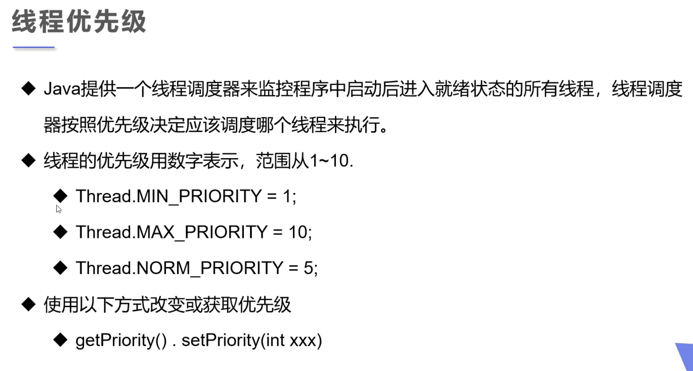
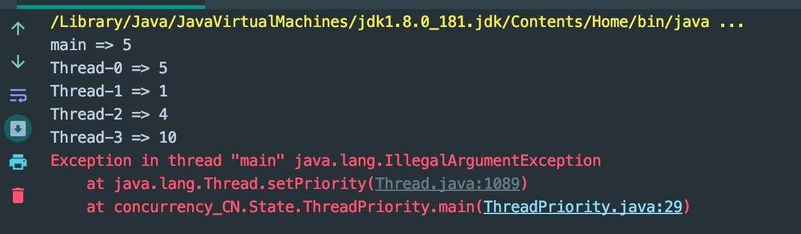
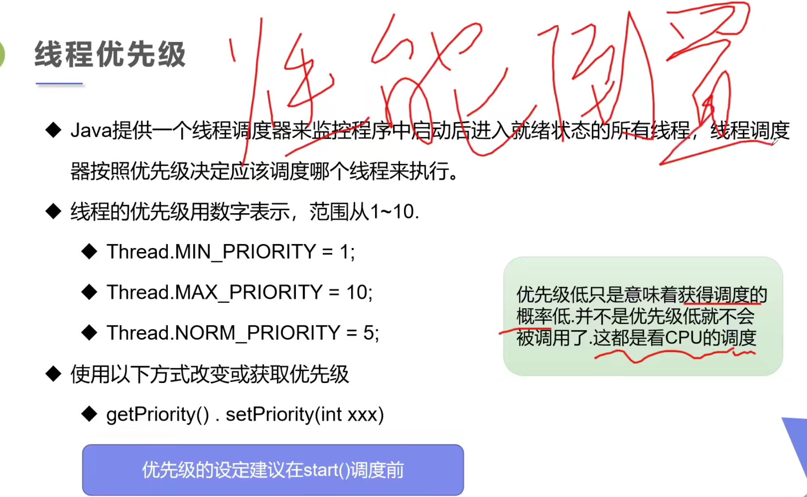
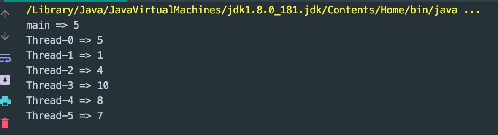

## Thread Priority



- 关于优先级数值，可以看源代码

```java
public class ThreadPriority {
    public static void main(String[] args) {
        //Main Thread 默认优先级
        System.out.println(Thread.currentThread().getName() + " => " + Thread.currentThread().getPriority());

        MyPriority myPriority = new MyPriority();

        Thread t1 = new Thread(myPriority);
        Thread t2 = new Thread(myPriority);
        Thread t3 = new Thread(myPriority);
        Thread t4 = new Thread(myPriority);
        Thread t5 = new Thread(myPriority);
        Thread t6 = new Thread(myPriority);

        //先设置优先级，再启动
        t1.start();

        t2.setPriority(1);
        t2.start();

        t3.setPriority(4);
        t3.start();

        t4.setPriority(Thread.MAX_PRIORITY); // 10
        t4.start();

        t5.setPriority(-1);
        t5.start();

        t6.setPriority(11);
        t6.start();
    }
}

class MyPriority implements Runnable {
    @Override
    public void run() {
        System.out.println(Thread.currentThread().getName() + " => " + Thread.currentThread().getPriority());
    }
}
```



---



- 最终还是看 CPU 调度:

```java
public class ThreadPriority {
    public static void main(String[] args) {
        //Main Thread 默认优先级
        System.out.println(Thread.currentThread().getName() + " => " + Thread.currentThread().getPriority());

        MyPriority myPriority = new MyPriority();

        Thread t1 = new Thread(myPriority);
        Thread t2 = new Thread(myPriority);
        Thread t3 = new Thread(myPriority);
        Thread t4 = new Thread(myPriority);
        Thread t5 = new Thread(myPriority);
        Thread t6 = new Thread(myPriority);

        //先设置优先级，再启动
        t1.start();

        t2.setPriority(1);
        t2.start();

        t3.setPriority(4);
        t3.start();

        t4.setPriority(Thread.MAX_PRIORITY); // 10
        t4.start();

        t5.setPriority(8);
        t5.start();

        t6.setPriority(7);
        t6.start();
    }
}

class MyPriority implements Runnable {
    @Override
    public void run() {
        System.out.println(Thread.currentThread().getName() + " => " + Thread.currentThread().getPriority());
    }
}
```

