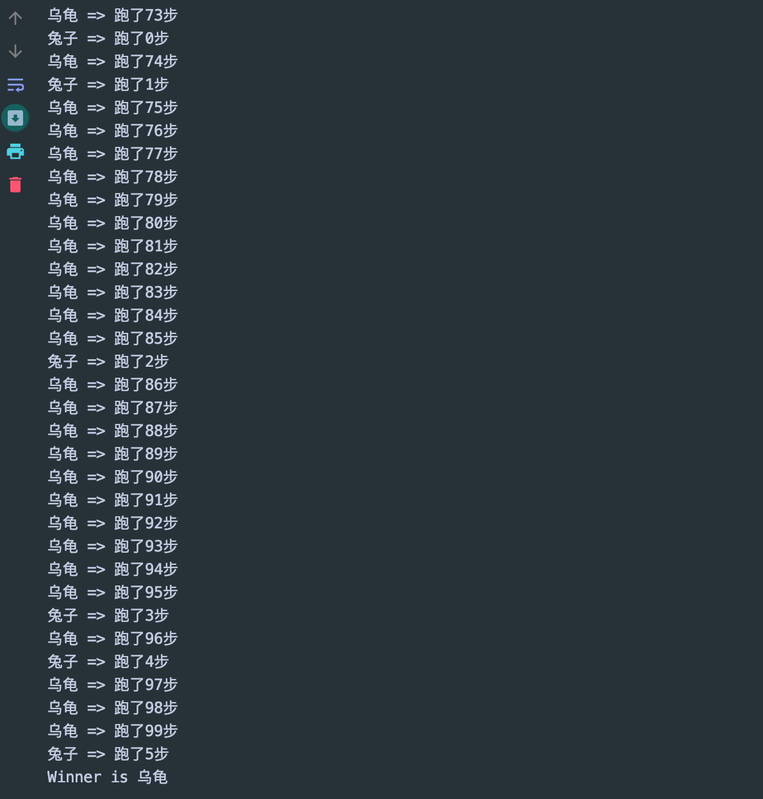

## Data Race

```java
// 模拟龟兔赛跑
public class Race implements Runnable{

    //Winner
    private static String winner;

    @Override
    public void run() {
        for (int i = 0; i <= 100; i++) {

            //模拟兔子休息
            if(Thread.currentThread().getName().equals("兔子") && i % 10==0){
                try {
                    Thread.sleep(1);
                } catch (InterruptedException e) {
                    e.printStackTrace();
                }
            }

            //判断比赛是否结束
            boolean flag = gameOver(i);
            //如果比赛结束，就停止程序
            if (flag) {
                break;
            }

            System.out.println(
                Thread.currentThread().getName() + " => 跑了" + i + "步");
        }
    }

    //判断是否完成比赛
    private boolean gameOver(int steps) {
        //判断是否有胜利者
        if (winner != null) {//已经决出胜利者
            return true;
        } {
            if (steps >= 100) {
                winner = Thread.currentThread().getName();
                System.out.println("Winner is " + winner);
                return true;
            }
        }
        return false;
    }

    public static void main(String[] args) {
        Race race = new Race();

        new Thread(race, "兔子").start();
        new Thread(race, "乌龟").start();
    }
}
```

