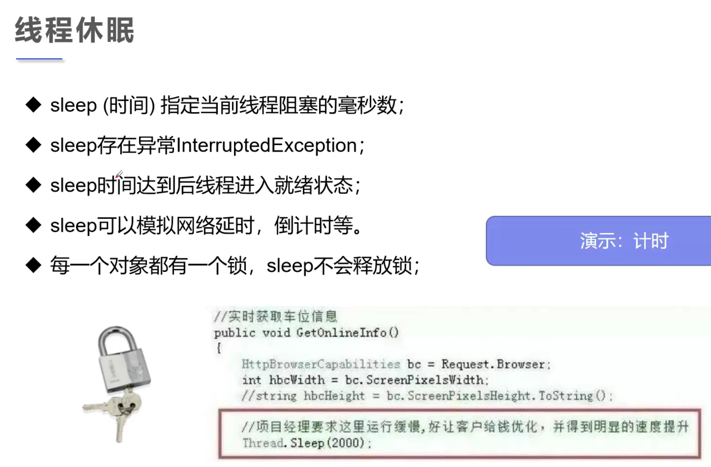
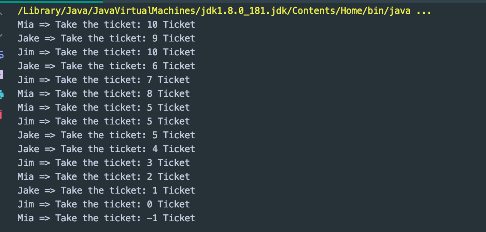
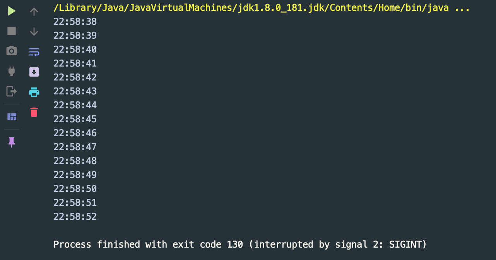

## Sleep()



- 来看之前的代码的问题:

```java
//模拟网络延时
public class ThreadSleep implements Runnable{
    //票数
    private int numOfTickets = 10;

    @Override
    public void run() {
        while (true) {
            if (numOfTickets <= 0) {
                break;
            }
            //模拟延时
            try {
                Thread.sleep(200);
            } catch (InterruptedException e) {
                e.printStackTrace();
            }
            System.out.println(Thread.currentThread().getName() + " => Take the ticket: " + numOfTickets-- + " Ticket");
        }
    }

    public static void main(String[] args) {
        TestThread4 ticket = new TestThread4();

        new Thread(ticket, "Mia").start();
        new Thread(ticket, "Jim").start();
        new Thread(ticket, "Jake").start();
    }
}
```



- 很明显数据是有问题的:
  - 多个线程操作了同一个对象

---

```java
//模拟倒计时
public class ThreadSleep2 {
    public static void main(String[] args) {
        //打印当前系统时间
        Date startTime = new Date(System.currentTimeMillis());//get the current system time
        while (true) {
            try {
//                countDown();
                Thread.sleep(1000);
                System.out.println(new SimpleDateFormat("HH:mm:ss").format(startTime));
                startTime = new Date(System.currentTimeMillis());//update current time
            } catch (InterruptedException e) {
                e.printStackTrace();
            }
        }
    }

    //模拟倒计时
    public static void countDown() throws InterruptedException {
        int num = 10;

        while (true) {
            Thread.sleep(1000);
            System.out.println(num--);
            if (num <= 0) {
                break;
            }
        }
    }
}
```

