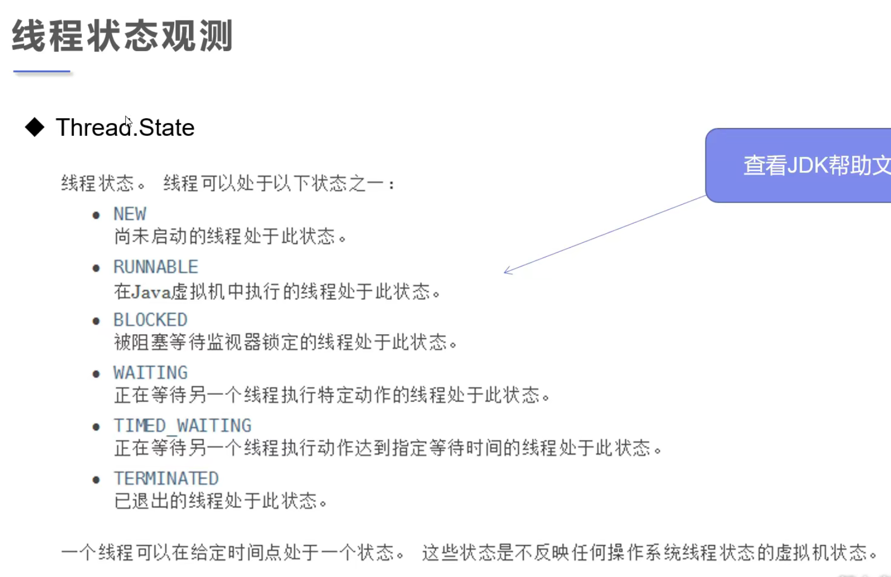
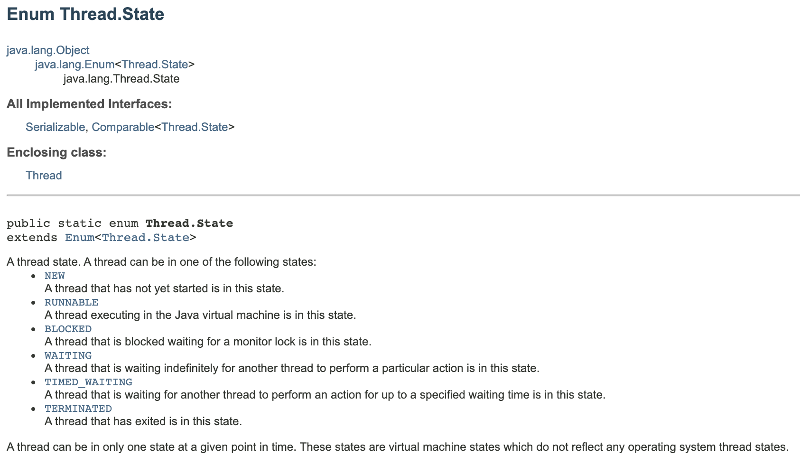
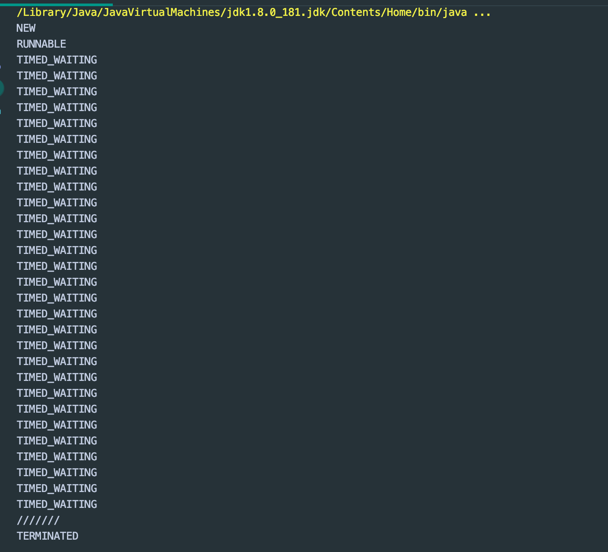

## 观测线程状态





```java
//观测线程的状态
public class ThreadState {
    public static void main(String[] args) throws InterruptedException {
        Thread thread = new Thread(()->{
            for (int i = 0; i < 3; i++) {
                try {
                    Thread.sleep(1000);
                } catch (InterruptedException e) {
                    e.printStackTrace();
                }
            }
            System.out.println("///////");
        });

        // 观察状态
        Thread.State state = thread.getState();
        System.out.println(state);

        //观察启动后
        thread.start();//启动线程
        state = thread.getState();
        System.out.println(state);//Run

        while (state != Thread.State.TERMINATED) {//只要线程不终止，就一只输出状态
            Thread.sleep(100);
            state = thread.getState(); //更新线程状态
            System.out.println(state);
        }
    }
}
```

