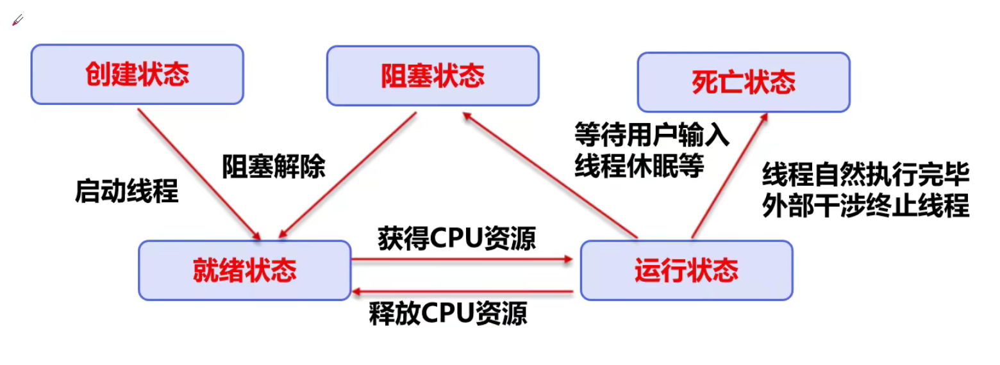
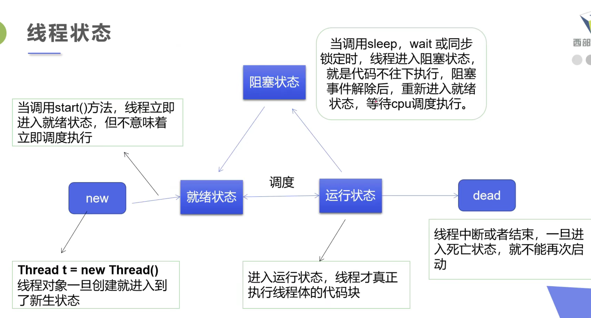
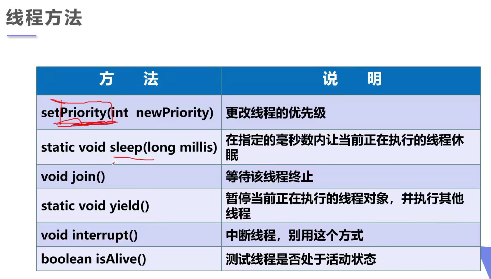
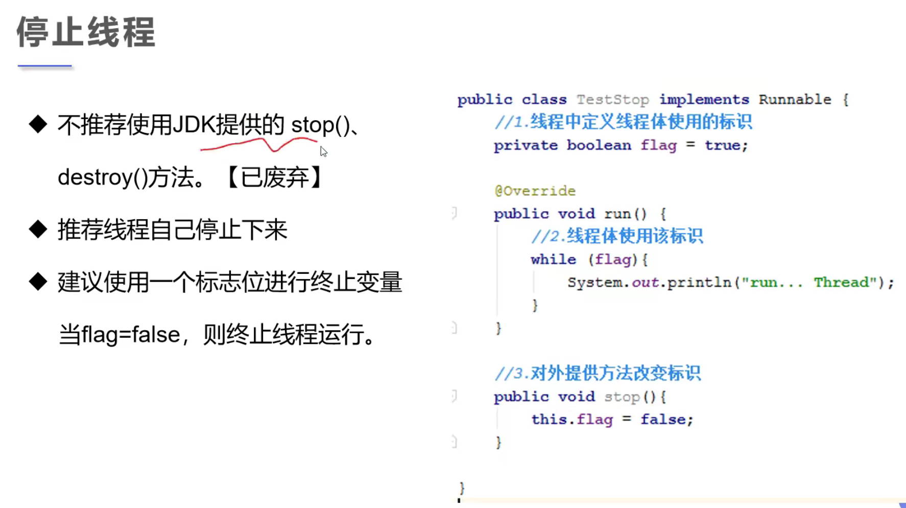
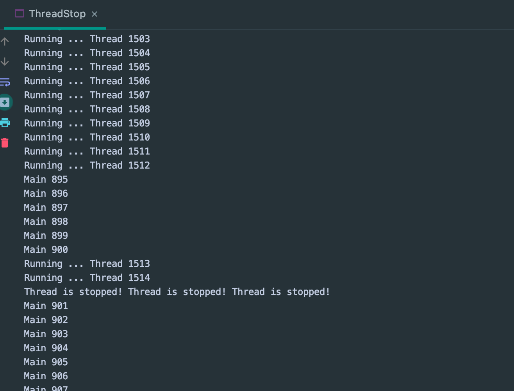

## 线程的停止









```java
//1. 建议线程正常停止 => 利用次数
//2. 建议使用 flag => 设置标志位
//3. 不用使用官方 stop , destroy
public class ThreadStop implements Runnable{

    //1. set a flag
    private boolean flag = true;

    @Override
    public void run() {
        int i = 0;
        while (flag) {
            System.out.println("Running ... Thread " + i++);
        }
    }

    //2. 设置一个方法停止线程，转换标志位
    public void stop() {
        this.flag = false;
    }

    public static void main(String[] args) {
        ThreadStop threadStop = new ThreadStop();
        new Thread(threadStop).start();

        for (int i = 0; i < 1000; i++) {
            System.out.println("Main " + i);
            if (i == 900) {
                //invoke stop(), 切换标志位，让线程停止
                threadStop.stop();
                System.out.println("Thread is stopped! Thread is stopped! Thread is stopped!");
            }
        }
    }
}
```

