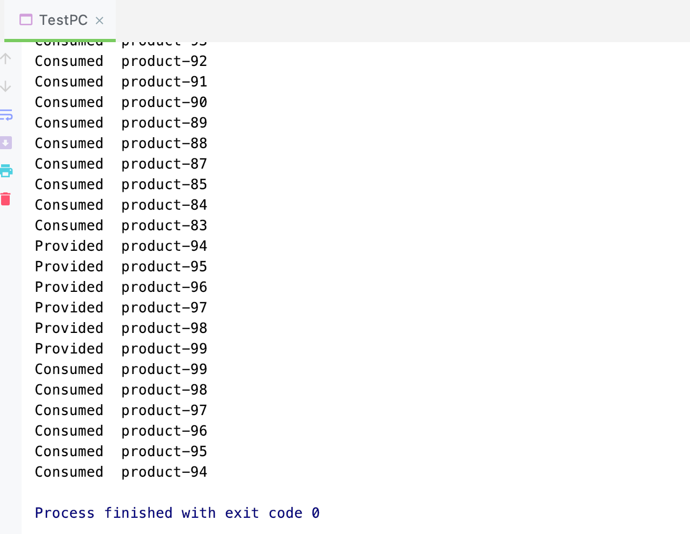

## 管程法

```java
//测试：生产者消费者模式 => 利用缓冲区解决：管程法

//producer, consumer, cache area
public class TestPC {
    public static void main(String[] args) {
        SynContainer container = new SynContainer();

        new Producer(container).start();
        new Consumer(container).start();
    }
}

//producer
class Producer extends Thread {
    SynContainer container;

    public Producer(SynContainer container) {
        this.container = container;
    }

    //生产

    @Override
    public void run() {
        for (int i = 0; i < 100; i++) {
            container.push(new Product(i));
            System.out.println("Provided " + " product-" + i);
        }
    }
}

//consumer
class Consumer extends Thread {
    SynContainer container;

    public Consumer(SynContainer container) {
        this.container = container;
    }

    //消费
    @Override
    public void run() {
        for (int i = 0; i < 100; i++) {
            System.out.println("Consumed " + " product-" + container.pop().id);
        }
    }
}

//product
class Product {
    int id; //产品编号

    public Product(int id) {
        this.id = id;
    }
}

//cache area
class SynContainer {
    //需要一个容器大小
    Product[] products = new Product[10];

    //容器计算器
    int count = 0;

    //producer放入产品
    public synchronized void push(Product product) {
        //如果容器满了，就需要等待消费者
        if (count == products.length) {
            //通知消费者消费，生产等待
            try {
                this.wait();
            } catch (InterruptedException e) {
                e.printStackTrace();
            }
        }

        //如果没有满，我们就需要丢入产品
        products[count] = product;
        count++;

        //可以通知消费者消费
        this.notifyAll();
    }

    //消费者消费产品
    public synchronized Product pop() {
        //判断是否消费
        if (count == 0) {
            //等待生产者生产，消费者等待
            try {
                this.wait();
            } catch (InterruptedException e) {
                e.printStackTrace();
            }
        }

        //如果可以消费
        count--;
        Product product =  products[count];

        //消费完了，通知生产者生产
        this.notifyAll();

        return product;
    }
}
```

