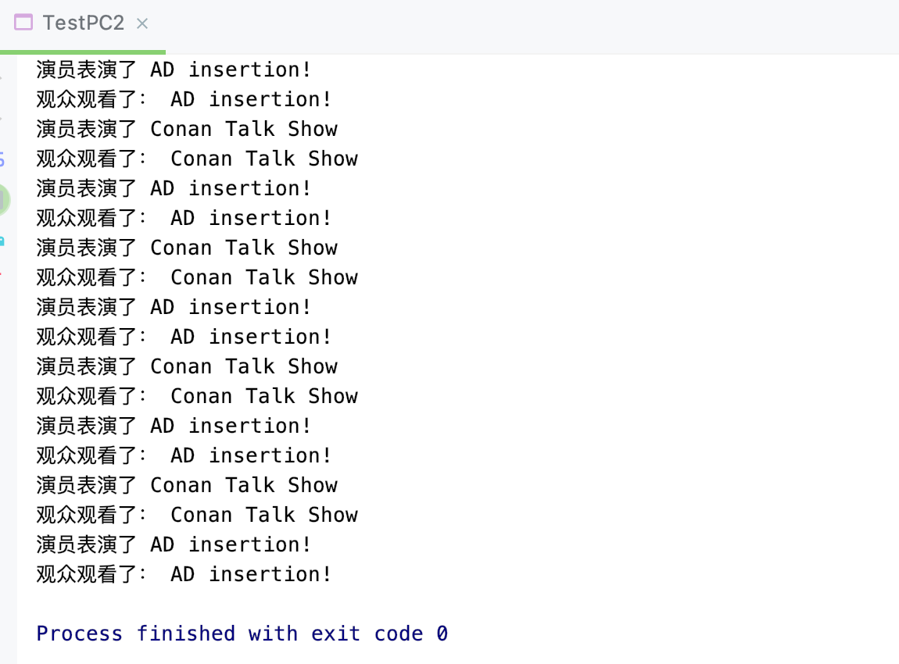

## 信号灯法

```java
//测试生产者消费者：信号灯法，标志位解决
public class TestPC2 {
    public static void main(String[] args) {
        TvShow talkShow = new TvShow();
        new Actor(talkShow).start();
        new Audience(talkShow).start();
    }
}

//Producer => Actor
class Actor extends Thread {
    TvShow ts;

    public Actor(TvShow ts) {
        this.ts = ts;
    }

    @Override
    public void run() {
        for (int i = 0; i < 20; i++) {
            if (i % 2 == 0) {
                this.ts.play("Conan Talk Show");
            } else {
                this.ts.play("AD insertion!");
            }
        }
    }
}

//Consumer => audience
class Audience extends Thread {
    TvShow ts;

    public Audience(TvShow ts) {
        this.ts = ts;
    }

    @Override
    public void run() {
        for (int i = 0; i < 20; i++) {
            ts.watch();
        }
    }
}

//Product => TV show
class TvShow {
    //actor表演的时候，观众等待
    //audience观看，演员等待
    String show; //表演的节目
    boolean flag = true;

    //表演
    public synchronized void play(String show) {
        if (!flag) {
            try {
                this.wait();
            } catch (InterruptedException e) {
                e.printStackTrace();
            }
        }

        System.out.println("演员表演了 " + show);
        //通知观众观看
        this.notifyAll();//通知唤醒所有其他线程
        this.show = show;
        this.flag = !this.flag;
    }

    //观看
    public synchronized void watch() {
        if (flag) {
            try {
                this.wait();
            } catch (InterruptedException e) {
                e.printStackTrace();
            }
        }
        System.out.println("观众观看了： " + show);
        //通知演员表演
        this.notifyAll();
        this.flag = !this.flag;
    }
}
```

