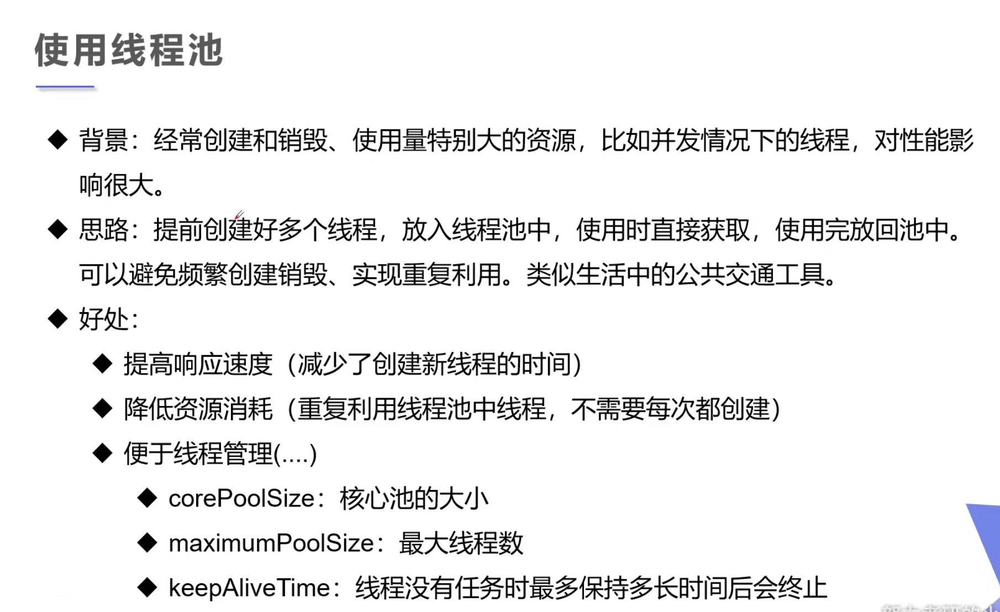
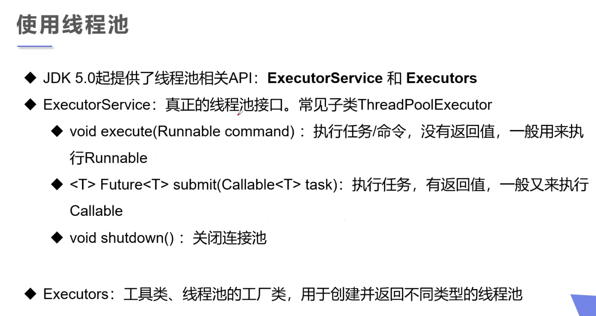
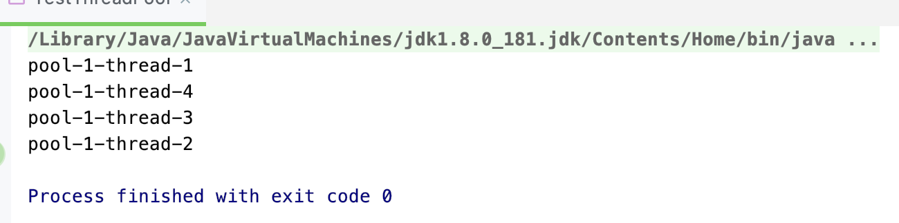

## 线程池 Thread Pool





- 1. 创建服务，渐渐线程池：

```java
public class TestThreadPool {
    public static void main(String[] args) {
        //1. 创建服务，创建线程池
        //newFixedThreadPool 参数为：线程池大小
        ExecutorService service = Executors.newFixedThreadPool(10);

        //执行
        service.execute(new MyThread());
        service.execute(new MyThread());
        service.execute(new MyThread());
        service.execute(new MyThread());

        //2. 关闭链接
        service.shutdown();
    }

    private static class MyThread implements Runnable {
        @Override
        public void run() {
            System.out.println(Thread.currentThread().getName());
        }
    }

}
```



