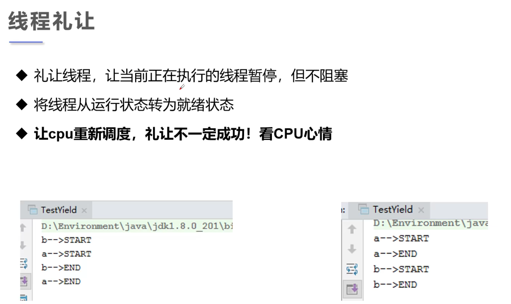
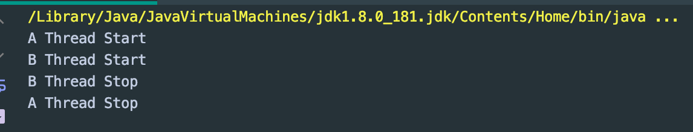

## yield



```java
// yield 不一定成功，看cpu心情
public class ThreadYield {
    public static void main(String[] args) {
        MyYield myYield = new MyYield();

        new Thread(myYield, "A").start();
        new Thread(myYield, "B").start();
    }
}

class MyYield implements Runnable {
    @Override
    public void run() {
        System.out.println(Thread.currentThread().getName() +  " Thread Start");
        Thread.yield();
        System.out.println(Thread.currentThread().getName() + " Thread Stop");
    }
}
```

