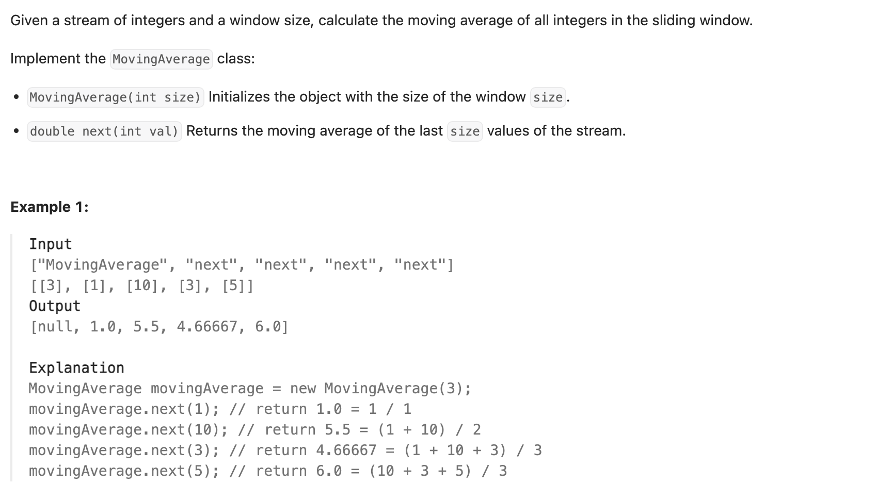

## 346. Moving Average from Data Stream

---

```py
class MovingAverage:

    def __init__(self, size: int):
        self.window = deque()
        self.k = size
        self.sum = 0 # the sum of all integers within the window

    def next(self, val: int) -> float:
        self.window.append(val)
        self.sum += val
        # The window should contain # of integers <= size
        if len(self.window) > self.k:
            self.sum -= self.window.popleft()
        return self.sum / len(self.window)

# Your MovingAverage object will be instantiated and called as such:
# obj = MovingAverage(size)
# param_1 = obj.next(val)
```