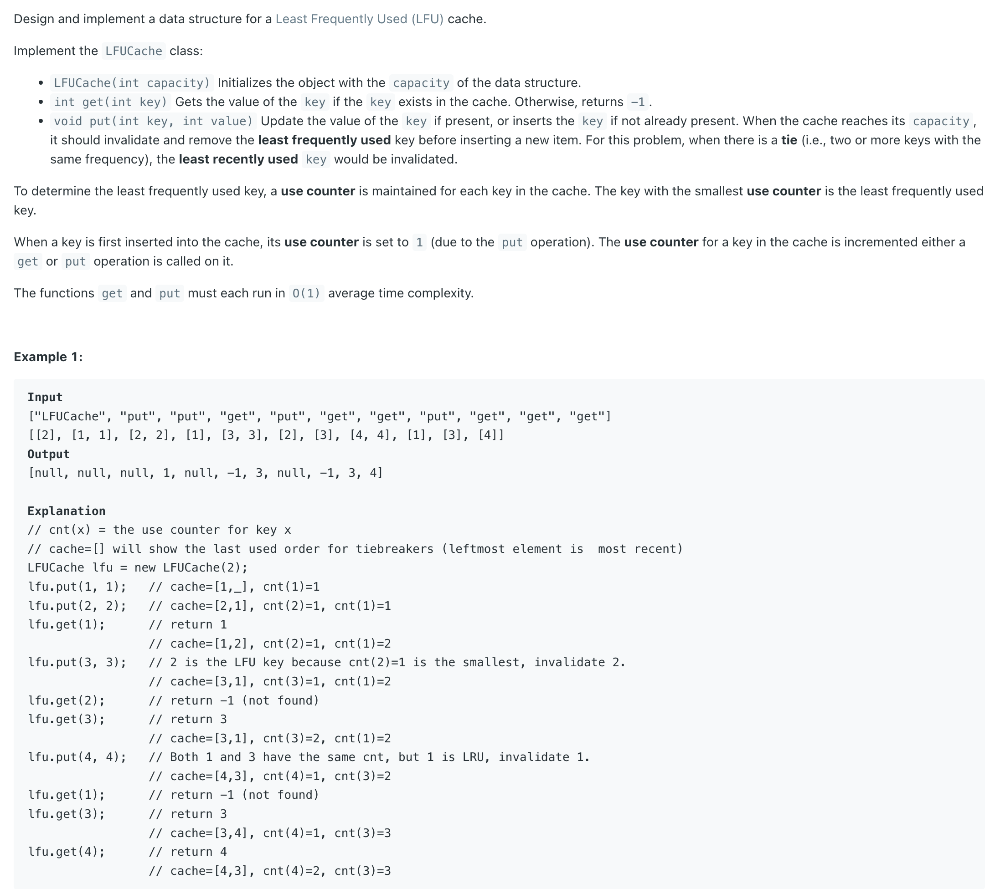

## 460. LFU Cache

---

#### Data Structures

- Recall **LRU** Cache:
  - Map<Integer, Node> => key : Node
  - Doubly LinkedList


- **LFU** Cache
  - Map<Integer, DLList> freq


- LFU Cache **Requirements**:
  - 1. Save all key's frequency
  - 2. Track the size of the all cache
  - 3.1 get(key) -> if **exist** -> frequency + 1, or **not exist** -> return -1
  - 3.2 put(key, val) 
    - -> if **key exists**:  1.modify node value  2. call get(key)
    - **not exist** -> add a new node to the cache, (if necessary, remove a node)

---

```java
class LFUCache {
    class Node {
        int key, val;
        int cnt;
        Node prev, next;

        public Node(int k, int v) {
            key = k;
            val = v;
            cnt = 1;
        }
    }

    class DLList {
        Node head, tail;
        int len;

        public DLList() {
            head = new Node(0, 0);
            tail = new Node(0, 0);
            head.next = tail;
            tail.next = head;
            len = 0;
        }

        public void addHead(Node node) {
            Node next = head.next;
            head.next = node;
            node.prev = head;
            node.next = next;
            next.prev = node;
            map.put(node.key, node);
            len++;
        }

        public void remove(Node node) {
            Node prev = node.prev;
            Node next = node.next;
            prev.next = next;
            next.prev = prev;
            len--;
            map.remove(node.key);
        }

        public void removeTail() {
            Node prevTail = tail.prev;
            remove(prevTail);
        }
    }

    Map<Integer, Node> map;
    Map<Integer, DLList> freq;
    int size;
    int capacity;
    int maxFreq;

    public LFUCache(int capacity) {
        map = new HashMap<>();
        freq = new HashMap<>();
        this.capacity = capacity;
        size = 0;
        maxFreq = 0;
    }

    public int get(int key) {
        if (map.get(key) == null) {
            return -1;
        }
        Node node = map.get(key);
        int prevFreq = node.cnt;
        DLList prevList = freq.get(prevFreq);
        prevList.remove(node);

        int curFreq = prevFreq + 1;
        maxFreq = Math.max(maxFreq, curFreq);
        DLList curList = freq.getOrDefault(curFreq, new DLList());
        node.cnt++;
        curList.addHead(node);
        freq.put(prevFreq, prevList);
        freq.put(curFreq, curList);
        return node.val;
    }

    public void put(int key, int value) {
        if (capacity == 0) {
            return;
        }
        if (map.get(key) != null) {
            map.get(key).val = value;
            get(key);
            return;
        }

        Node node = new Node(key, value);
        DLList curList = freq.getOrDefault(1, new DLList());
        curList.addHead(node);
        size++;
        if (size > capacity) {
            if (curList.len > 1) {
                curList.removeTail();
            } else {
                for (int i = 2; i <= maxFreq; i++) {
                    if (freq.get(i) != null && freq.get(i).len > 0) {
                        freq.get(i).removeTail();
                        break;
                    }
                }
            }
            size--;
        }
        freq.put(1, curList);
    }
}
```